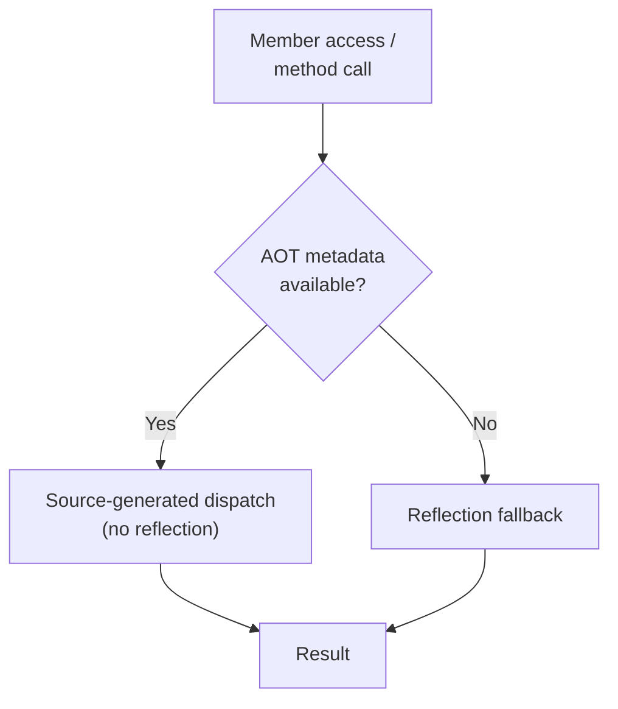

Alder runs on NativeAOT, Unity IL2CPP, and every other .NET platform — including environments where reflection is restricted and runtime code generation is unavailable. A single NuGet package, same API, same behavior across all platforms.

This is enabled by a two-tier dispatch model:

An incremental source generator runs at compile time and emits typed dispatch code for each registered type — property access, field access, method invocation, constructor calls, indexer operations, and pre-instantiated delegate factories. At runtime, the interpreter checks this metadata before falling back to reflection.

On full .NET with JIT, the compiler backend (`UseCompiler()`) is also available — it emits LINQ expression trees compiled to native IL delegates. On NativeAOT where `Expression.Compile()` is unavailable, the interpreter with AOT metadata provides the execution path.

## Deep-Dive

| Page | What it covers |
|------|---------------|
| [AOT Overview](overview.md) | Two-tier model, source generator usage, IAotTypeMetadata interface, delegate factories, generic instantiation rooting, built-in context, generator limitations |
