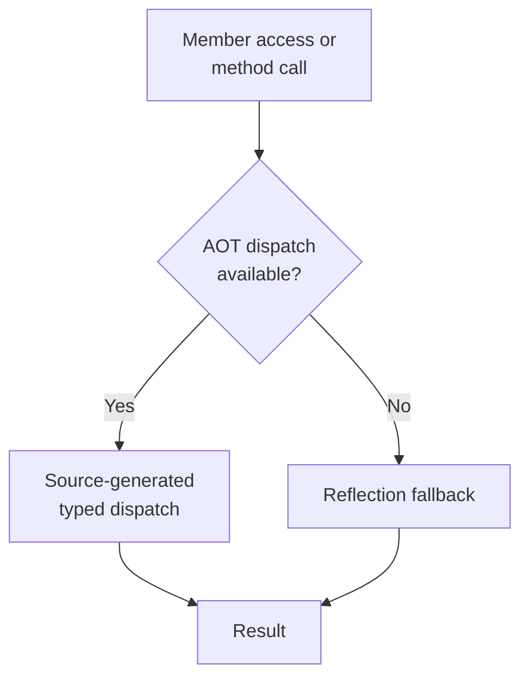

Alder runs on NativeAOT, Unity IL2CPP, and every other .NET platform — including environments where reflection is restricted and runtime code generation is unavailable. Same API, same behavior, single NuGet package, no conditional compilation in user code.

## Two-Tier Dispatch



At every member access and method invocation, the engine checks for source-generator-produced typed dispatch before falling back to reflection. An incremental source generator runs at compile time and emits typed code for each registered type — property access, field access, method invocation, constructor calls, indexer operations, and delegate factories. No reflection needed on the AOT path.

On full .NET with JIT, the compiler backend (`UseCompiler()`) is also available. On NativeAOT where `Expression.Compile()` is unavailable, the interpreter with AOT dispatch provides the execution path.

## Quick Start

```csharp
using Alder.Aot;

[AlderRegistered(typeof(List<int>))]
[AlderRegistered(typeof(Dictionary<string, int>))]
[AlderRegistered(typeof(DateTime))]
public partial class MyTypeContext : AlderTypeContext { }
```

```csharp
var engine = new AlderEngine(o =>
{
    o.Aot.UseGeneratedContext(new MyTypeContext());
});
```

Alder also ships with a built-in AOT context that provides dispatch for common BCL types (`string`, `int`, `DateTime`, `List<T>`, etc.) — registered by default, no user action needed.

## Full Reference

For the complete AOT documentation — `ITypedDispatch` interface, delegate factories, generic instantiation rooting, LINQ extension method dispatch, and generator limitations — see the [AOT Overview](overview.md).
