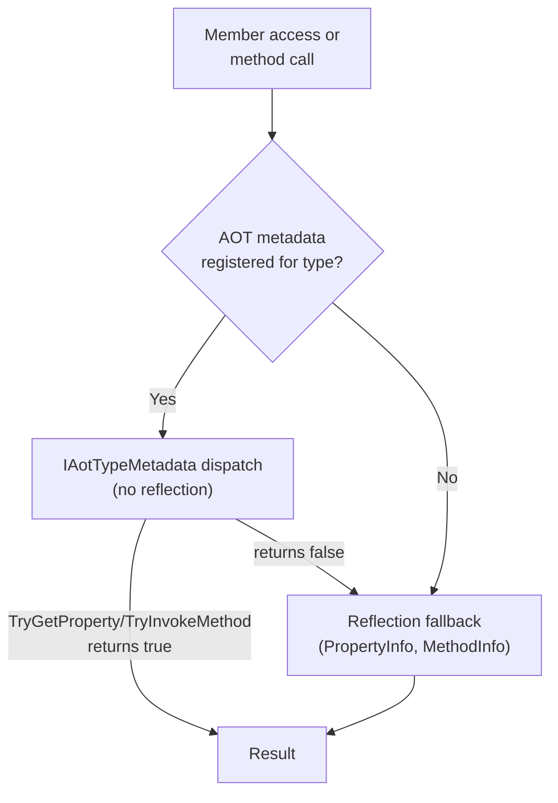

Alder runs on NativeAOT, Unity IL2CPP, and every other .NET platform — including environments where reflection is restricted and runtime code generation is unavailable. This is enabled by a two-tier dispatch model backed by an incremental source generator.

The source generator runs at compile time and emits typed property access, method dispatch, constructor invocation, and pre-instantiated delegate factories for each registered type. At runtime, the interpreter checks this AOT-generated metadata before falling back to reflection. The same expression that evaluates on full .NET with JIT compilation evaluates on NativeAOT and IL2CPP through the interpreter with AOT metadata — same API, same behavior, single NuGet package, no conditional compilation in user code.

## Two-Tier Model



The AOT check happens at every member access and method invocation in the interpreter. The check walks the type hierarchy — if metadata is registered for `List<int>`, accessing members inherited from `IList<int>` or `ICollection<int>` will also use the AOT path.

## When AOT Matters

- **NativeAOT (.NET 7+)**: `MakeGenericMethod` with value-type arguments is restricted. The source generator pre-instantiates generic methods and delegate factories to avoid this.
- **Unity IL2CPP**: Same restrictions as NativeAOT — no runtime code generation. The interpreter with AOT metadata is the only execution path.
- **Standard .NET**: AOT metadata provides a performance benefit by skipping reflection, but reflection works fine as a fallback.

On NativeAOT, `UseCompiler()` throws `PlatformNotSupportedException` because `Expression.Compile()` requires a JIT. The interpreter with AOT metadata is the recommended path.

## Source Generator

Alder ships an incremental source generator that produces `IAotTypeMetadata` implementations for registered types. To use it:

### 1. Define a type context

```csharp
using Alder.Aot;

[AlderRegistered(typeof(List<int>))]
[AlderRegistered(typeof(Dictionary<string, int>))]
[AlderRegistered(typeof(DateTime))]
public partial class MyTypeContext : AlderTypeContext
{
}
```

### 2. Register it with the engine

```csharp
var engine = new AlderEngine(o =>
{
    o.Aot.UseGeneratedContext(new MyTypeContext());
});
```

### 3. The generator emits

For each `[AlderRegistered]` type, the generator produces a `file sealed class` implementing `IAotTypeMetadata` with:

| Method | Generated code |
|--------|---------------|
| `TryGetProperty(name, instance, out value)` | `switch` on property name → typed property access |
| `TrySetProperty(name, instance, value)` | `switch` on property name → typed property setter |
| `TryGetField(name, instance, out value)` | `switch` on field name → typed field access |
| `TrySetField(name, instance, value)` | `switch` on field name → typed field setter |
| `TryGetIndex(instance, key, out value)` | Typed indexer get |
| `TrySetIndex(instance, key, value)` | Typed indexer set |
| `TryGetStaticProperty(name, out value)` | Static property access |
| `TryGetStaticField(name, out value)` | Static field access |
| `TryCreateInstance(args, out instance)` | Constructor dispatch |
| `TryInvokeMethod(name, instance, args, out result)` | Instance method dispatch with `is` type checks per overload |
| `TryInvokeStaticMethod(name, args, out result)` | Static method dispatch |

All dispatch uses `is` type checks for same-arity overloads — never blind casts that rely on exception fallback. If the AOT path can't handle an argument shape (named args, null values, special markers), it returns `false` and the reflection path takes over.

## `IAotTypeMetadata` Interface

```csharp
public interface IAotTypeMetadata
{
    Type Type { get; }
    bool TryGetProperty(string name, object instance, out object? value);
    bool TrySetProperty(string name, object instance, object? value);
    bool TryGetField(string name, object instance, out object? value);
    bool TrySetField(string name, object instance, object? value);
    bool TryGetIndex(object instance, object key, out object? value);
    bool TrySetIndex(object instance, object key, object? value);
    bool TryGetStaticProperty(string name, out object? value);
    bool TryGetStaticField(string name, out object? value);
    bool TryCreateInstance(object?[] args, out object? instance);
    bool TryInvokeMethod(string name, object instance, object?[] args, out object? result);
    bool TryInvokeStaticMethod(string name, object?[] args, out object? result);
}
```

Every method returns `bool`. `true` means the operation was handled, `false` signals fallback to reflection. No exceptions for control flow.

## Delegate Factories

On NativeAOT, `MakeGenericMethod` with value-type generic arguments is restricted. Alder uses lambda-to-delegate conversion extensively (every LINQ lambda needs to be converted to `Func<T, bool>`, `Func<T, TResult>`, etc.). When `T` is a value type, this conversion requires `MakeGenericMethod` to create the delegate factory.

The source generator pre-instantiates delegate factories for common shapes:

| Delegate shape | Purpose |
|---------------|---------|
| `Func<T, bool>` | LINQ predicates (`Where`, `Any`, `All`, `First`) |
| `Func<T, T>` | Identity transforms (`Select`) |
| `Func<T, int>` | Integer projections |
| `Func<T, string>` | String projections |
| `Func<T, object>` | Boxing projections |
| `Action<T>` | Side effects |
| `Func<T, T, T>` | `Aggregate` |
| `Func<T, T, bool>` | Comparison predicates |
| `Comparison<T>` | `Sort` |

Each factory is a `Func<object, Delegate>` that wraps a `LambdaValue` in the target delegate type. These are registered via `AlderTypeContext.GetDelegateFactories()` and stored in `AlderConfig.DelegateFactories`.

## Generic Instantiation Rooting

The generator also emits static field roots that force the AOT compiler to compile specific generic instantiations:

- `Nullable<T>` for each registered value type
- `EqualityComparer<T>`, `Comparer<T>` for comparisons
- `List<T>`, `IEnumerable<T>` for collection operations
- LINQ methods: `ToList<T>`, `ToArray<T>`, `Count<T>` via method-group-to-delegate conversion

This ensures that when an expression calls `items.ToList()` where `items` is `IEnumerable<int>`, the AOT-compiled binary contains the `Enumerable.ToList<int>` instantiation.

## Built-In Context

Alder ships with a built-in AOT context (`AlderBuiltInContext`) that provides metadata for common BCL types. This is registered by default — no user action needed for standard types like `string`, `int`, `DateTime`, `List<T>`, etc.

To disable the built-in context (e.g., to reduce binary size in AOT scenarios where only specific types are needed):

```csharp
o.Aot.ClearBuiltInContext();
o.Aot.UseGeneratedContext(new MyMinimalContext());
```

## What the Generator Does NOT Handle

The generator skips:
- **Generic methods**: Only non-generic methods are emitted in the dispatch code. Generic method calls (like `Enumerable.Select<T, TResult>`) go through the reflection path with pre-rooted instantiations.
- **`ref`/`in`/`params` parameters**: Methods with ref-kind parameters are skipped.
- **`ref` return types**: Methods that return by ref are skipped.
- **Pointer types and ref-like types** (`Span<T>`, `ReadOnlySpan<T>`): Parameters or returns with these types are skipped.

These limitations are by design — the AOT path handles the common case (property access, simple method calls), and the reflection path handles everything else. The two-tier model means no user-visible functionality is lost.
