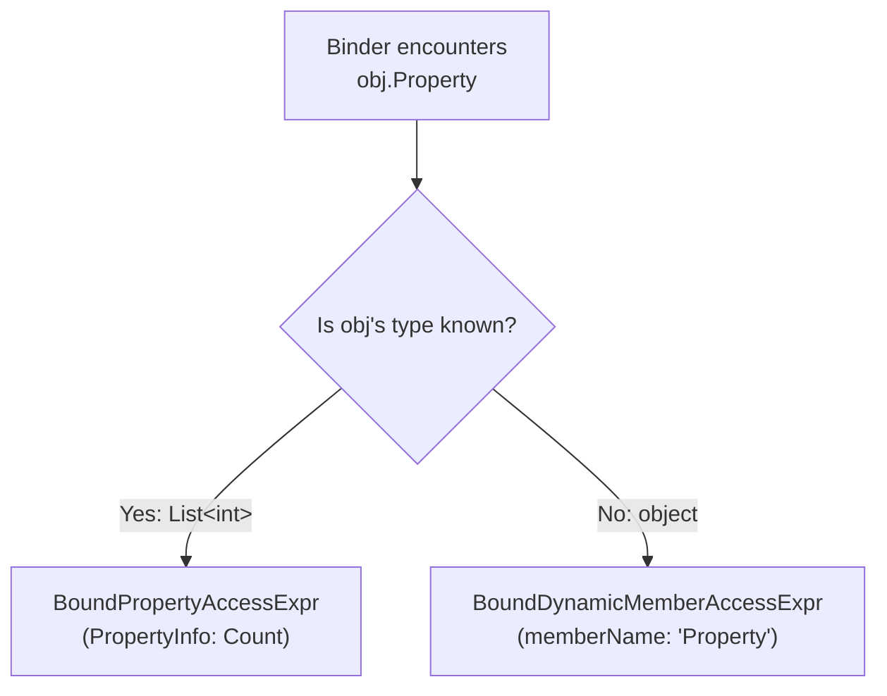

The binder performs semantic analysis — it takes the untyped AST from the parser, resolves identifiers, members, operators, and types, and produces a typed bound tree (`BoundExpr`) where every node carries a `BoundType`.

## Core Design: Resolved vs Dynamic Nodes

The binder's central architectural decision is the split between **resolved** and **dynamic** bound nodes. When the binder has enough type information to select a specific member or method at bind time, it produces a resolved node. When types are unknown (`object`), it produces a dynamic node that defers resolution to runtime.



| Resolved node | Dynamic counterpart | When resolved is used |
|--------------|---------------------|----------------------|
| `BoundPropertyAccessExpr` | `BoundDynamicMemberAccessExpr` | Target type has a public property with that name |
| `BoundFieldAccessExpr` | `BoundDynamicMemberAccessExpr` | Target type has a public field with that name |
| `BoundMethodGroupExpr` | `BoundDynamicMemberAccessExpr` | Target type has public methods with that name |
| `BoundResolvedCallExpr` | `BoundDynamicCallExpr` | All argument types are known, no lambdas/named args/out args |
| `BoundResolvedIndexAccessExpr` | `BoundDynamicIndexAccessExpr` | Target type has a known indexer |
| `BoundResolvedMultiDimIndexAccessExpr` | `BoundDynamicMultiDimIndexAccessExpr` | Multi-dimensional array or multi-param indexer |

This split enables three things:
1. **Performance**: Resolved nodes carry `PropertyInfo`/`FieldInfo`/`MethodInfo` directly — the interpreter invokes them without reflection lookup.
2. **AOT dispatch**: The source generator emits type-safe dispatch code for resolved node types. Dynamic nodes fall back to reflection.
3. **Diagnostics**: When the binder knows the type, it can report `CS1061: 'String' does not contain a definition for 'Foo'` at bind time. Dynamic nodes defer error discovery to runtime.

## BoundType Hierarchy

Every `BoundExpr` carries a `StaticType` of type `BoundType`:

| Type | `ClrType` | Meaning |
|------|-----------|---------|
| `BoundType(typeof(int))` | `int` | Known concrete type |
| `BoundStructuralType(typeof(ExpandoObject), members)` | `ExpandoObject` | CLR type + structural member metadata (for anonymous objects) |
| `BoundUnknownType` | `object` | Type could not be determined — runtime dispatch required |
| `BoundVoidType` | `object` | Node is a statement that doesn't produce a value |

`BoundStructuralType` is used for anonymous objects (`new { Name = "Alice", Age = 30 }`) where the CLR type is `ExpandoObject` (which has no properties via reflection) but the binder knows the member names and types from the initializer. This enables member resolution on anonymous objects at bind time.

## Binding Process

### 1. Identifier Resolution (`BindIdentifier`)

When the binder encounters an identifier:

1. Check if it's a registered function or module name → `BoundIdentifierExpr(name, BoundType.Unknown)` (resolved at runtime)
2. Check binder-local scope (`BindingContext.TryGetLocal`) → `BoundIdentifierExpr(name, localType, localId)` with the exact type from the declaration
3. Check variable type from the runtime context (`BindingContext.TryGetVariableType`) → three sub-paths:
   - `SetVariable<T>` declared type → `BoundIdentifierExpr(name, BoundType(typeof(T)))`
   - Untyped variable with a runtime value → `BoundIdentifierExpr(name, BoundType(value.GetType()))`
   - No variable found → attempt type name resolution, or produce `BoundIdentifierExpr(name, BoundType.Unknown)`

### 2. Member Access Resolution (`BindMemberAccess`)

The binder chains member accesses iteratively (not recursively) to handle deep chains like `a.b.c.d` efficiently. For each link:

1. Resolve the target's `BoundType`
2. Call `MemberBinderService.TryBindMemberRead(targetType, memberName, isStatic, ...)`
3. Result determines the node type:
   - `Property` → `BoundPropertyAccessExpr` with the `PropertyInfo`
   - `Field` → `BoundFieldAccessExpr` with the `FieldInfo`
   - `MethodGroup` → `BoundMethodGroupExpr` with the declaring type and method name
   - `StructuralMember` → falls through to dynamic (structural members are resolved at runtime via ExpandoObject)
   - `NotFound` → `BoundDynamicMemberAccessExpr` (may succeed at runtime if the actual type has the member)

For module access (e.g., `Math.Round`), the binder checks `BindingContext.RuntimeContext.Modules` as a fallback when normal member resolution fails.

### 3. Call Resolution (`BindCall`)

Call binding has two fast paths and a dynamic fallback:

**Static module call** (`TryBindStaticModuleCall`): If the callee is `module.Method(args)` and the module is a static class, the binder resolves directly against the module's type using `CallBinderService.TryBindStaticCall`.

**Resolved method call** (`BindCallWithBoundCallee`): If the callee is a `BoundMethodGroupExpr` and ALL arguments are simple (no lambdas, no named arguments, no out arguments), the binder extracts argument types and calls `CallBinderService.TryBindInstanceCall` or `TryBindStaticCall`. If overload resolution succeeds, it produces `BoundResolvedCallExpr` with the selected `MethodInfo`.

**Dynamic fallback**: If arguments contain lambdas, named arguments, or out arguments, or if the target type is unknown, the binder produces `BoundDynamicCallExpr`. The runtime handles overload resolution, lambda delegate conversion, and named argument mapping.

### 4. Type Inference for Binary Operators (`InferBinaryResultType`)

The binder infers the result type of binary operations at bind time using ECMA-334 numeric promotion rules:

1. Comparison/equality operators → `bool`
2. Spaceship → `int`
3. String concatenation → `string`
4. Power (`**`) → `double`
5. Both arithmetic → `InferArithmeticResultType` (follows the 8-rule ECMA-334 §12.4.7.3 chain)
6. One `object`, one arithmetic → infer from the arithmetic side (for lambda return type inference)
7. Everything else → `object` (runtime dispatch)

`NormalizeArithmeticType` handles unary numeric promotion: `char`, `byte`, `sbyte`, `short`, `ushort` all promote to `int`.

### 5. Statement Scoping

The binder creates child `BindingContext` scopes for:
- Block expressions (`{ ... }`)
- `if` then/else branches
- `for` loop (initializer scope + body scope)
- `while`/`do-while` body
- `foreach` body (iterator variable declared here)
- `try`/`catch`/`finally` bodies
- `using`/`lock` bodies

Variable declarations call `BindingContext.DeclareLocal(name, type, isReadOnly)`, which assigns a `LocalId`. This ID is used by the interpreter for fast variable lookup without string-keyed dictionary access.

## Recovering Mode

The binder supports two modes:

**Normal mode** (`recovering: false`): Throws `AlderException` on the first binding error. Used during evaluation.

**Recovering mode** (`recovering: true`): Catches binding errors and records them as diagnostics on the bound node (`HasErrors = true`, `Diagnostic = ...`). Continues binding the rest of the tree. Used by `TryValidate` to collect all errors in a single pass, and by `AlderExpression.GetOrCreateBoundExpression` to catch binding failures gracefully.

In recovering mode, failed nodes are replaced with `BoundLiteralExpr(null, BoundType.Unknown)` carrying the diagnostic. Downstream binding continues but may produce cascading errors.

## Left-Deep Chain Iterativization

Binary operators, logical operators, and null-coalescing operators use iterative left-deep unwinding instead of recursive binding. The binder collects the chain:

```
a + b + c + d
→ BinaryExpr(BinaryExpr(BinaryExpr(a, +, b), +, c), +, d)
```

It unwinds the left spine into a list, binds the leftmost operand, then processes right operands in order:

```csharp
var chain = new List<BinaryExpr>();
Expr leftmost = binary;
while (leftmost is BinaryExpr b)
{
    chain.Add(b);
    leftmost = b.Left;
}
var result = Bind(leftmost, context);
for (var i = chain.Count - 1; i >= 0; i--)
{
    var right = Bind(chain[i].Right, context);
    result = new BoundBinaryExpr(op, result, right, resultType);
}
```

This prevents stack overflow on deeply nested left-associative expressions (e.g., summing 1000 numbers) without requiring the parser to produce flat lists.

## BoundNodeKind

The bound tree uses 63 node kinds defined in `BoundNodeKind`. ECMA-334-equivalent kinds reuse Roslyn's `BoundKind` numbers for familiarity:

| Range | Category | Examples |
|-------|----------|---------|
| 27–113 | Roslyn-compatible | `UnaryOperator(27)`, `BinaryOperator(40)`, `Block(85)`, `Literal(113)` |
| 1000–1003 | Member access | `PropertyAccess`, `FieldAccess`, `MethodGroup`, `DynamicMemberAccess` |
| 1010–1015 | Expressions | `Identifier`, `LogicalOperator`, `ChainedComparison`, `Checked`, `Slice`, `Pipeline` |
| 1020–1023 | Invocations | `ResolvedCall`, `DynamicCall`, `NamedArgument`, `OutArgument` |
| 1030–1033 | Index access | `ResolvedIndexAccess`, `DynamicIndexAccess`, `ResolvedMultiDimIndex`, `DynamicMultiDimIndex` |
| 1040–1048 | Assignments | `MemberAssignment`, `IndexAssignment`, compound/null-coalesce/increment variants |
| 1060–1065 | Literals/collections | `ObjectLiteral`, `ArrayLiteral`, `TypedArrayCreation`, `MultiDimArrayInit` |
| 1070–1071 | Control flow | `GotoCaseStatement`, `GotoDefaultStatement` |

## Constant Expression Detection

`BoundExpr.IsConstantExpression` implements ECMA-334 §12.23: a constant expression is a literal, a unary `+`/`-` on a constant, a cast of a constant, a checked/unchecked wrapper of a constant, or a binary operation on two constants. This is used to gate §10.2.11 implicit constant expression conversions (e.g., `int` constant 0 can implicitly convert to `uint`). The check is iterative to handle left-deep binary chains without stack overflow.

## Services

The binder delegates to two service classes:

**`MemberBinderService`**: Resolves member reads and index access against CLR types via `TypeMetadataProvider`. Handles properties, fields, method groups, indexers, and structural members.

**`CallBinderService`**: Resolves method calls by gathering overload candidates and running `OverloadResolver.TryResolve`. Produces `CallBindResult` containing the `ResolvedCall` (selected method + argument mapping).

Both services are instantiated per-binding, not cached across evaluations.
