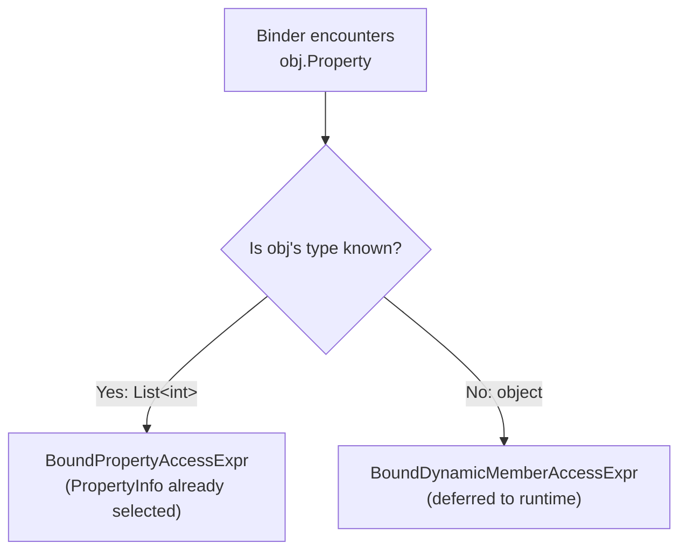

The binder is the heart of Alder's compiler pipeline. It takes the untyped AST from the parser, resolves identifiers, members, operators, and types, and produces a typed bound tree where every node carries a `BoundType`. This is where the runtime engine's intelligence lives — the binder is what turns a string of C# into something that can execute with full type safety.

## Per-Node Strategy

Each AST node type has a dedicated binder class annotated with `[BindsNode(typeof(XxxExpr))]`. Dispatch is source-generated at compile time by an incremental generator — the generated code maps each `Expr` subclass to its binder's static `Bind` method. This keeps each binder focused on one construct's semantics and avoids a monolithic switch statement.

## Resolved vs Dynamic Nodes

The binder's central architectural decision. When the binder has enough type information to select a specific member at bind time, it produces a **resolved** node. When types are unknown (`object`), it produces a **dynamic** node that defers resolution to runtime.

| Resolved node | Dynamic counterpart | When resolved is used |
|--------------|---------------------|----------------------|
| `BoundPropertyAccessExpr` | `BoundDynamicMemberAccessExpr` | Target type has a public property with that name |
| `BoundFieldAccessExpr` | `BoundDynamicMemberAccessExpr` | Target type has a public field with that name |
| `BoundMethodGroupExpr` | `BoundDynamicMemberAccessExpr` | Target type has public methods with that name |
| `BoundResolvedCallExpr` | `BoundDynamicCallExpr` | All argument types are known, no lambdas/named args/out args |
| `BoundResolvedIndexAccessExpr` | `BoundDynamicIndexAccessExpr` | Target type has a known indexer |
| `BoundResolvedMultiDimIndexAccessExpr` | `BoundDynamicMultiDimIndexAccessExpr` | Multi-dimensional array or multi-param indexer |

This split enables three things:
1. **Performance**: Resolved nodes carry the exact `PropertyInfo`/`FieldInfo`/`MethodInfo` — the interpreter invokes them directly, no reflection lookup needed.
2. **AOT dispatch**: The source generator reads resolved node metadata to emit type-safe dispatch code. Dynamic nodes fall back to reflection.
3. **Diagnostics**: When the binder knows the type, it reports `CS1061` at bind time. Dynamic nodes defer error discovery to runtime.

## BoundType Hierarchy

Every bound node carries a `StaticType` of type `BoundType`:

| Type | Meaning |
|------|---------|
| `BoundType(typeof(int))` | Known concrete type |
| `BoundStructuralType(typeof(ExpandoObject), members)` | CLR type + structural metadata — used for anonymous objects where the binder knows member names and types from the initializer |
| `BoundUnknownType` | Type could not be determined — runtime dispatch required |
| `BoundVoidType` | Statement that doesn't produce a value |

`BoundStructuralType` is what makes member resolution work on anonymous objects (`new { Name = "Alice", Age = 30 }`). The CLR type is `ExpandoObject` (which has no properties via reflection), but the binder knows the members from the initializer expression.

## Binding Process

### Identifier Resolution

When the binder encounters an identifier, it checks sources in priority order:

1. **Functions and modules** → produces an identifier node resolved at runtime
2. **Binder-local scope** (from `var` declarations, `foreach` iterators, lambda parameters) → the exact type from the declaration
3. **Engine variables** → three sub-paths:
   - `SetVariable<T>` → the declared type `T`
   - Untyped variable with a runtime value → the value's runtime type
   - Not found → attempt type name resolution, or produce an unknown-typed identifier

### Member Access Resolution

The binder chains member accesses iteratively (not recursively) to handle deep chains like `a.b.c.d` efficiently. For each link, it resolves the target's type, looks up the member, and produces the appropriate node:

- **Property** → `BoundPropertyAccessExpr` with the `PropertyInfo`
- **Field** → `BoundFieldAccessExpr` with the `FieldInfo`
- **Method group** → `BoundMethodGroupExpr` with the declaring type and method name
- **Not found** → `BoundDynamicMemberAccessExpr` (may succeed at runtime if the actual type has the member)

For module access (e.g., `Math.Round`), the binder checks registered modules as a fallback when normal member resolution fails.

### Call Resolution

Call binding has two fast paths and a dynamic fallback:

**Static module call**: If the callee is `module.Method(args)` and the module is a static class, the binder resolves directly against the module's type.

**Resolved method call**: If the callee is a method group and ALL arguments are simple (no lambdas, no named arguments, no out arguments), the binder extracts argument types and runs overload resolution. If it succeeds, it produces `BoundResolvedCallExpr` with the selected method.

**Dynamic fallback**: If arguments contain lambdas, named arguments, or out arguments, or if the target type is unknown, the binder produces `BoundDynamicCallExpr`. The runtime handles overload resolution, lambda delegate conversion, and named argument mapping.

### Binary Operator Type Inference

The binder infers the result type of binary operations at bind time using ECMA-334 numeric promotion rules:

1. Comparison/equality operators → `bool`
2. Spaceship (`<=>`) → `int`
3. String concatenation → `string`
4. Power (`**`) → `double`
5. Both arithmetic → follows the 8-rule ECMA-334 §12.4.7.3 promotion chain (see [Numeric Promotion](numeric-promotion.md))
6. One `object`, one arithmetic → infer from the arithmetic side (enables lambda return type inference)
7. Everything else → `object` (runtime dispatch)

### Statement Scoping

The binder creates child scopes for blocks, `if` branches, loops, `try`/`catch`/`finally`, `using`, and `lock`. Variable declarations within a scope assign a `LocalId` — an integer used by the interpreter for fast variable lookup without string-keyed dictionary access.

## Recovering Mode

The binder supports two modes:

**Normal mode**: Throws on the first binding error. Used during evaluation — fail fast.

**Recovering mode**: Catches errors, records them as diagnostics on the bound node, and continues binding the rest of the tree. Used by `TryValidate` to collect all errors in a single pass, giving users a complete picture of what's wrong.

In recovering mode, failed nodes are replaced with null-literal placeholders carrying the diagnostic. Downstream binding continues but may produce cascading errors.

## Left-Deep Chain Optimization

Binary operators, logical operators, and null-coalescing operators use iterative left-deep unwinding instead of recursive binding. A long chain like `a + b + c + d + ... + z` is unwound into a flat list, then processed iteratively. This prevents stack overflow on deeply nested left-associative expressions without requiring the parser to produce flat lists.

## BoundNodeKind

The bound tree uses node kinds defined in `BoundNodeKind`. ECMA-334-equivalent kinds reuse Roslyn's `BoundKind` numbers for familiarity (e.g., `BinaryOperator = 40`, `Block = 85`). Alder-specific kinds start at 1000.

## Constant Expression Detection

`BoundExpr.IsConstantExpression` implements ECMA-334 §12.23: a constant expression is a literal, a unary `+`/`-` on a constant, a cast of a constant, or a binary operation on two constants. This gates §10.2.11 implicit constant expression conversions (e.g., `int` constant 0 can implicitly convert to `uint`). The check is iterative to handle left-deep binary chains without stack overflow.
