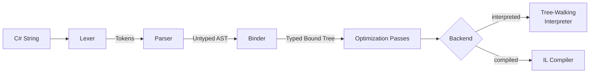

Alder implements a full compiler pipeline: the same multi-stage architecture used by production C# compilers. Semantic analysis, type inference, optimization passes, and two interchangeable execution backends.

This architecture is what makes the rest of the engine possible: LINQ with generic type inference works because the binder resolves types. ECMA-334 overload resolution works because the binder selects methods. Pattern matching works because the bound tree carries type information. Precise diagnostics with source positions work because every node tracks its origin. AOT dispatch works because resolved nodes carry enough metadata for source generators.

## Pipeline

Each stage has a single responsibility and a well-defined contract with the next:

**Lexer**. Scans the source character-by-character into tokens. Single-pass, no backtracking. Handles all C# literal forms through C# 11 (raw strings, interpolated strings, hex/binary), all operators, keywords, and Extended mode syntax.

**Parser**. Transforms tokens into an untyped AST using precedence climbing. Five cooperating sub-parsers handle expressions, primary forms, patterns, statements, and LINQ query syntax. LINQ queries desugar to method calls here. Extended mode features are gated here: using `**` or `[1, 2, 3]` in Standard mode fails with `ALDR0020`.

**Binder**. The heart of the engine. Performs semantic analysis: resolves identifiers to variables, types, and modules. Resolves member access to specific properties, fields, and methods. Infers types for operators and calls. Produces a typed bound tree where every node knows its result type. The central design decision is the split between **resolved** nodes (exact member selected at bind time) and **dynamic** nodes (deferred to runtime when types are unknown). This split enables AOT dispatch, compile-time diagnostics, and faster evaluation.

**Optimization Passes**. A configurable pipeline of bound tree transformations. Security validation (always first), constant folding, dead branch elimination, and for the compiler path, explicit type conversion insertion.

**Execution**. Two backends consume the same bound tree. The interpreter walks it node by node. The compiler translates it to LINQ expression trees and compiles to native IL delegates. Both produce identical results for all supported constructs. The compiler backend is swappable via `IExpressionCompiler`.

## Design Principles

**Delegate to .NET.** Alder bridges dynamic evaluation to .NET's actual runtime. `.Where()` calls the real `Enumerable.Where`. `Math.Round` calls the real `Math.Round`. Type conversions follow CLR rules. The engine doesn't reimplement what .NET already provides.

**Resolved vs dynamic nodes.** When the binder knows a variable's type (from `SetVariable<T>`), it resolves `.Count` to a specific `PropertyInfo` and `.Where()` to a specific `MethodInfo` at bind time. When the type is `object`, resolution defers to runtime. Resolved nodes carry enough metadata for the source generator to emit type-safe dispatch.

**Per-node strategy pattern.** Both the binder and interpreter use source-generated dispatch: each AST/bound node type has a dedicated handler class, with the mapping generated at compile time. No virtual dispatch overhead, no visitor boilerplate.

**Signal-based control flow.** `break`, `continue`, `return`, `goto`, `yield return`, and `yield break` produce `ControlFlowSignal` values that propagate through the evaluation stack as ordinary return values. This keeps the fast path clean and makes control flow composable across nested constructs.

**Two-tier AOT dispatch.** At every member access and method call, the engine checks for source-generator-produced typed dispatch before falling back to reflection. The same code runs on full .NET (with reflection as fallback) and NativeAOT/IL2CPP (with typed dispatch as the primary path).

## Deep-Dives

| Page | What it covers |
|------|---------------|
| [Pipeline](pipeline.md) | Stage-by-stage walkthrough with inputs, outputs, caching, and AOT integration |
| [Binder](binder.md) | Resolved vs dynamic nodes, BoundType hierarchy, identifier/member/call resolution, scoping |
| [Overload Resolution](overload-resolution.md) | ECMA-334 §12.6.4: candidate construction, applicability, better-function-member, tie-breaking |
| [Type Inference](type-inference.md) | ECMA-334 §12.6.3: bounds collection, iterative fixing, lambda return type inference |
| [Bound Tree Pipeline](bound-tree-pipeline.md) | Security validation, constant folding, dead branch elimination, conversion insertion |
| [Interpreter](interpreter.md) | Tree-walking evaluation, numeric dispatch, control flow signals, AOT integration |
| [Compiler](compiler.md) | LINQ expression tree emission, local promotion, identifier hoisting, delegate caching |
| [Numeric Promotion](numeric-promotion.md) | ECMA-334 §12.4.7.3: the 8 promotion rules, char edge cases, constant promotion, checked arithmetic |
