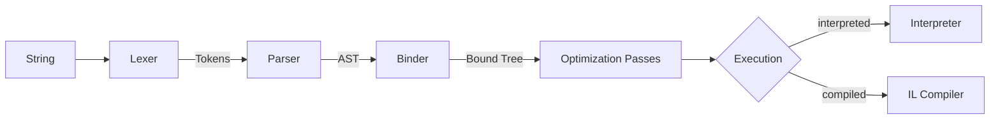

Alder is a C# runtime evaluator with AOT-first dispatch. It implements a full compiler pipeline — the same architecture that production C# compilers use. This is what enables LINQ with generic type inference, ECMA-334 overload resolution, pattern matching, precise diagnostics with source positions, and two interchangeable execution backends that produce identical results.

An expression string flows through five stages:

**Lexer**: single-pass character scanner producing tokens. Handles all C# literal forms through C# 11, including raw strings, interpolated strings, hex/binary numbers, and 150+ token types.

**Parser**: precedence-climbing parser producing an untyped AST. LINQ query syntax desugars to method calls at this stage. Extended mode features are gated here.

**Binder**: performs semantic analysis using a per-node strategy pattern — ~75 static binder classes in `Binding/Binders/`, each annotated with `[BindsNode(typeof(XxxExpr))]`, with dispatch source-generated by `BinderDispatchGenerator`. Resolves identifiers to variables, types, and modules. Resolves member access to specific properties, fields, and methods. Infers types for operators and calls. Produces a typed bound tree where every node knows its type, enabling the key architectural split between *resolved* nodes (exact member selected at bind time) and *dynamic* nodes (deferred to runtime).

**Optimization Passes**: a configurable pipeline of bound tree transformations. Security validation, constant folding, dead branch elimination, and (for the compiler path) type conversion insertion.

**Execution**: two backends share the same bound tree. The interpreter walks it using a per-node strategy pattern — 71 static evaluator classes in `Interpretation/Evaluators/`, each annotated with `[EvaluatesNode(BoundNodeKind.Xxx)]`, with dispatch source-generated by `EvaluatorDispatchGenerator`. The compiler translates it to LINQ expression trees and compiles to native IL delegates. Both backends produce identical results for all supported constructs.

## Deep-Dives

| Page | What it covers |
|------|---------------|
| [Pipeline](pipeline.md) | Detailed stage-by-stage walkthrough — inputs, outputs, and behavior at each stage |
| [Binder](binder.md) | Per-node strategy, resolved vs dynamic nodes, BoundType hierarchy, identifier/member/call resolution, scoping, recovering mode |
| [Overload Resolution](overload-resolution.md) | ECMA-334 §12.6.4 — candidate construction, applicability checking, better-function-member comparison, tie-breaking rules, constructor resolution |
| [Type Inference](type-inference.md) | ECMA-334 §12.6.3 — lower/upper/exact bounds, iterative fixing, lambda return type inference, variance handling |
| [Interpreter](interpreter.md) | Per-node strategy evaluation, NumericDispatch fast path, ControlFlowSignal propagation, AOT integration, context management |
| [Compiler](compiler.md) | LINQ expression tree emission, local promotion, identifier hoisting, ConversionInsertionPass, delegate caching, NativeAOT guard |
| [Numeric Promotion](numeric-promotion.md) | ECMA-334 §12.4.7.3 — the 8 rules, char edge cases, constant promotion, fast path vs fallback, checked arithmetic |
| [Bound Tree Pipeline](bound-tree-pipeline.md) | SecurityValidationPass, ConstantFoldingPass, DeadBranchEliminationPass, ConversionInsertionPass |
