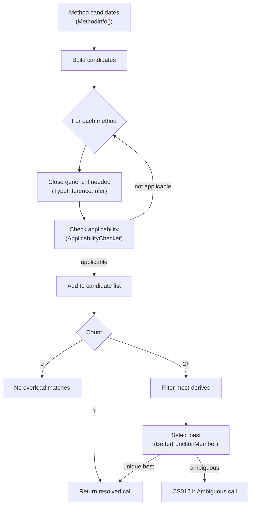

Alder implements ECMA-334 §12.6.4 overload resolution for method calls, extension methods, and constructor invocation. The implementation handles normal and expanded (params) forms, generic type inference, lambda return type inference, named arguments, and the full better-function-member comparison algorithm.

## Overview

## Phase 1: Candidate Construction

For each method in the candidate set:

1. **Close generic methods**: If the method is generic, attempt to close it:
   - If explicit type arguments are provided (`Method<int>(...)`), apply them directly
   - Otherwise, run `TypeInference.Infer` to deduce type arguments from argument types and lambda bodies
   - If inference fails, the method is not a candidate

2. **Check applicability** (`ApplicabilityChecker.IsApplicable`):
   - **Normal form**: Arguments match parameters 1:1 (with defaults allowed for trailing parameters)
   - **Expanded form**: If the last parameter has `[ParamArray]`, trailing arguments are packed into the array
   - For each argument-parameter pair, classify the conversion (identity, implicit numeric, implicit reference, lambda-to-delegate, boxing, user-defined, out argument)
   - If any argument cannot be converted to its parameter type, the method is not applicable

3. **Pre-compute lambda return types**: For arguments that are lambdas, evaluate the lambda body with the candidate's parameter types to determine the return type. This is stored on the `MethodCandidate` for use in the better-function-member comparison.

## Phase 2: Most-Derived Filtering

If multiple candidates remain, remove methods whose declaring type is a base type of another candidate's declaring type. This ensures that overrides in derived types are preferred over base implementations.

## Phase 3: Best Function Member Selection

Compare each pair of remaining candidates using the ECMA-334 §12.6.4.4 better-function-member rules:

### Per-argument comparison

For each argument position, compare the two candidates' parameter types:

1. **Exact match**: If one candidate's parameter type exactly matches the argument type (or, for lambdas, the inferred return type matches the delegate's return type), that candidate wins for this argument.

2. **Better conversion target** (`TypeHelpers.CompareBetterConversionTarget`): Between two parameter types, the "closer" type wins. This uses ECMA-334 §12.6.4.7 rules — e.g., `int` is a better target than `long` for an `int` argument, because `int → int` is identity while `int → long` is widening.

3. **Lambda return type**: For lambda arguments, if the inferred return type matches one delegate's return type exactly, that candidate wins.

If one candidate is better for at least one argument and not worse for any argument, it wins. If both have arguments where they're better, the result is `Neither` and tie-breaking applies.

### Tie-breaking rules (in order)

1. **Non-generic beats generic**: A non-generic method is preferred over a generic instantiation.
2. **Normal form beats expanded form**: Normal parameter matching is preferred over params expansion.
3. **Fewer elements in expanded params**: When both are expanded, fewer packed elements wins.
4. **More specific parameter types**: Using the uninstantiated generic parameters, the more specific type wins. A concrete type is more specific than a type parameter.
5. **Better parameter conversion targets**: Fallback comparison of raw parameter types.
6. **Fewer default values used**: A method that fills all parameters from arguments is preferred over one that uses defaults.
7. **Fewer generic type parameters**: Among generic methods, fewer type parameters is more specific.

If all tie-breaking rules produce `Neither`, the overload is ambiguous (`CS0121`).

## Constructor Resolution

Constructor overload resolution uses `OverloadResolver.TryResolveConstructor`. This gathers the type's public constructors as candidates and runs the same applicability, most-derived filtering, and best-function-member pipeline described above. The resolved constructor is invoked directly — Alder does not use `Activator.CreateInstance` for constructor dispatch.

## Argument Descriptors

Each argument is described by an `ArgumentDescriptor`:

| Property | Description |
|----------|-------------|
| `Kind` | `Value`, `Lambda`, `Null`, `Named`, `Out` |
| `StaticType` | The CLR type of the argument (`null` for lambdas and null values) |
| `RuntimeValue` | The actual value (for lambdas: the `LambdaValue` object) |
| `Name` | The named argument name, if any |

## Argument-Parameter Mapping

`ArgumentParameterMap` tracks how arguments map to parameters:

| Source kind | Description |
|------------|-------------|
| `Argument(index)` | Parameter filled by the argument at the given index |
| `Default` | Parameter filled by its default value |
| `Params(count)` | Parameter filled by packing `count` trailing arguments into an array |

The `ParamsParameterIndex` field indicates which parameter (if any) receives packed arguments.

## Conversion Classification

`ApplicabilityChecker.TryClassifyConversion` classifies each argument-parameter conversion:

| Classification | Condition |
|---------------|-----------|
| `Identity` | Argument type exactly matches parameter type |
| `ImplicitNumeric` | `TypeHelpers.CanImplicitlyConvert(argType, paramType)` is true |
| `ImplicitReference` | `paramType.IsAssignableFrom(argType)` (inheritance, interface, boxing) |
| `LambdaToDelegate` | Argument is a lambda, parameter is a delegate with matching arity |
| `Null` | Argument is null, parameter is nullable or reference type |
| `OutArgument` | Argument is `out`, parameter is `ref` (by-ref) |

If none of these match, the argument is not convertible and the method is not applicable.

## Extension Method Resolution

Extension methods are resolved through `OverloadResolver.TryResolveExtension`, which:

1. Prepends the target object as the first argument (`receiverAndArgs`)
2. For each extension method, checks that the first parameter is compatible with the target type (`IsExtensionCompatible`)
3. Runs the same applicability → most-derived → best-function-member pipeline

Extension methods are searched per-type in the order registered on `AlderOptions.Types.ExtensionTypes`. `System.Linq.Enumerable` is registered by default at position 0.

## Lambda Return Type Inference

During candidate construction, `PreComputeLambdaReturnTypes` evaluates each lambda argument's body to determine its return type. This is necessary for ECMA-334 §12.6.4.4 better-function-member comparison, where the lambda return type determines which delegate parameter type is a better conversion target.

The process:
1. Extract the delegate type from the parameter (e.g., `Func<int, bool>`)
2. Get the delegate's `Invoke` method and its parameter types
3. Create `BoundType[]` input types from the delegate's parameters
4. Call `ExtensionMethodResolver.InferLambdaReturnType(lambdaValue, inputTypes, context)` which evaluates the lambda body with those input types
5. Store the result in `MethodCandidate.LambdaReturnTypes[argIndex]`

This is what makes `items.Select(x => x.Name)` resolve correctly when `Select` has multiple overloads — the inferred return type `string` helps the binder choose `Func<T, string>` over `Func<T, int, string>`.

## Caching

Resolved overloads are cached in two locations:

- **`ResolutionCache`**: Caches `ResolvedCall` results keyed by `(Type declaringType, string methodName, ArgumentDescriptor[])`. Used by the interpreter's `MethodInvoker` for repeated calls with the same argument shapes. The cache is bypassed when explicit generic type arguments are provided (different closures of the same generic method need separate resolution).
- **`ExtensionMethodResolver`**: Three-layer cache — (1) methods by name per extension type, (2) arity-filtered methods, (3) fully resolved calls in an LRU cache (4096 entries, FIFO eviction) keyed by `InvocationCacheKey` which captures the extension type, target type, method name, case sensitivity, type argument signature, and per-argument shape (null vs runtime type). Cache entries for "not found" are stored as `null` values to prevent repeated fruitless lookups. Entries with lambda, named, or out arguments bypass the cache entirely (their shapes are too complex to key reliably).
