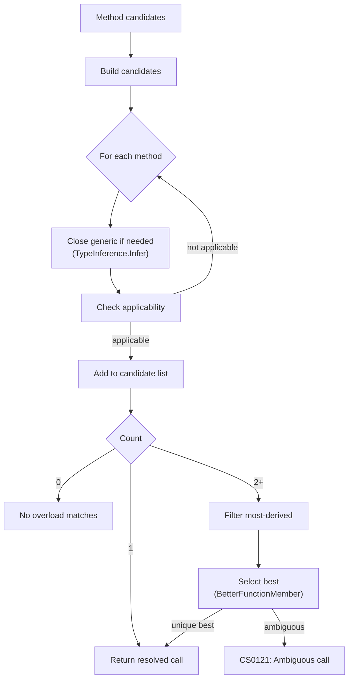

Alder implements ECMA-334 §12.6.4 overload resolution for method calls, extension methods, and constructor invocation. The implementation handles normal and expanded (params) forms, generic type inference, lambda return type inference, named arguments, and the full better-function-member comparison algorithm.

## Overview

## Phase 1: Candidate Construction

For each method in the candidate set:

1. **Close generic methods**: If the method is generic, close it, either with explicit type arguments (`Method<int>(...)`) or via ECMA-334 §12.6.3 type inference from argument types and lambda bodies (see [Type Inference](type-inference.md)). If inference fails, the method is not a candidate.

2. **Check applicability**: For each argument-parameter pair, classify the conversion (identity, implicit numeric, implicit reference, lambda-to-delegate, boxing, user-defined, out argument). Normal form matches arguments 1:1 (with defaults for trailing parameters). Expanded form packs trailing arguments into a `[ParamArray]` parameter. If any argument cannot be converted, the method is not applicable.

3. **Pre-compute lambda return types**: For lambda arguments, evaluate the lambda body with the candidate's parameter types to determine the return type. This is stored on the candidate for use in better-function-member comparison.

## Phase 2: Most-Derived Filtering

If multiple candidates remain, remove methods whose declaring type is a base type of another candidate's declaring type. Overrides in derived types are preferred over base implementations.

## Phase 3: Best Function Member Selection

Compare each pair of remaining candidates using ECMA-334 §12.6.4.4:

### Per-argument comparison

For each argument position, compare the two candidates' parameter types:

1. **Exact match**: If one parameter type exactly matches the argument type, that candidate wins for this argument.
2. **Better conversion target** (§12.6.4.7): Between two parameter types, the "closer" type wins (e.g., `int` is better than `long` for an `int` argument because `int → int` is identity while `int → long` is widening).
3. **Lambda return type**: If the inferred return type matches one delegate's return type exactly, that candidate wins.

If one candidate is better for at least one argument and not worse for any, it wins. If both have arguments where they're better, tie-breaking applies.

### Tie-breaking rules (in order)

1. **Non-generic beats generic**: A non-generic method is preferred over a generic instantiation.
2. **Normal form beats expanded form**: Normal parameter matching over params expansion.
3. **Fewer elements in expanded params**: When both are expanded, fewer packed elements wins.
4. **More specific parameter types**: Using uninstantiated generic parameters, the more specific type wins. A concrete type is more specific than a type parameter.
5. **Better parameter conversion targets**: Fallback comparison of raw parameter types.
6. **Fewer default values used**: A method that fills all parameters from arguments over one that uses defaults.
7. **Fewer generic type parameters**: Among generic methods, fewer type parameters is more specific.

If all tie-breaking rules produce no winner, the overload is ambiguous (`CS0121`).

## Constructor Resolution

Constructor overload resolution gathers the type's public constructors as candidates and runs the same pipeline: applicability, most-derived filtering, best-function-member. The resolved constructor is invoked directly.

## Extension Method Resolution

Extension methods are resolved by prepending the target object as the first argument, then running the standard pipeline. Extension methods are searched per-type in the order registered on `AlderOptions.Types.ExtensionTypes`. `System.Linq.Enumerable` is registered by default at position 0. User-registered extension types are inserted at index 0, giving them priority.

## Lambda Return Type Inference

During candidate construction, each lambda argument's body is evaluated with the candidate's parameter types to determine the return type. This is how `items.Select(x => x.Name)` resolves correctly when `Select` has multiple overloads: the inferred return type `string` helps select `Func<T, string>` over `Func<T, int, string>`.

## Argument-Parameter Mapping

Each argument is described by its kind (`Value`, `Lambda`, `Null`, or `Out`), static type, and runtime value. Named arguments are handled via a wrapper type. The mapping tracks how arguments fill parameters: directly by position, via default values, or by packing into a params array.

## Conversion Classification

Each argument-parameter conversion is classified:

| Classification | Condition |
|---------------|-----------|
| Identity | Argument type exactly matches parameter type |
| Implicit Numeric | Widening numeric conversion (e.g., `int` → `long`) |
| Implicit Reference | Inheritance, interface implementation, boxing |
| Lambda-to-Delegate | Lambda argument, delegate parameter with matching arity |
| Null | Null argument, nullable or reference-type parameter |
| Out Argument | `out` argument, `ref` parameter |

If none match, the method is not applicable for that argument.

## Caching

Resolved overloads are cached keyed by declaring type, method name, and argument shape. Calls with the same argument shapes hit the cache directly. The cache is bypassed when explicit generic type arguments are provided (different closures need separate resolution).

Extension method resolution uses a multi-layer cache with FIFO eviction: methods by name per extension type, arity-filtered methods, and fully resolved calls. Cache entries for "not found" are stored to prevent repeated fruitless lookups. Entries with lambda, named, or out arguments bypass the cache (their shapes are too complex to key reliably).
