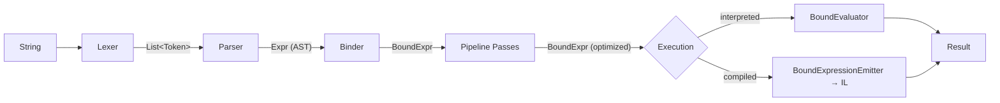

Every expression Alder evaluates passes through a five-stage pipeline. The pipeline transforms a string into a result, with each stage having a well-defined input, output, and responsibility.



## Stage 1: Lexing

**Input**: `string` (the expression text)
**Output**: `List<Token>`
The lexer scans the source character-by-character and produces a flat token list. Single-pass, no backtracking.

It handles:
- All C# numeric literal forms: decimal, hex (`0x`), binary (`0b`), digit separators (`_`), suffixes (`L`, `U`, `UL`, `F`, `D`, `M`), leading decimal (`.5`), scientific notation (`1.5e-3`)
- Six string forms: regular, verbatim (`@""`), raw (C# 11 `"""`), interpolated (`$""`), verbatim-interpolated (`$@""` / `@$""`), raw-interpolated (`$"""`)
- C# 11 raw string indentation stripping
- Escape sequences: `\n`, `\r`, `\t`, `\0`, `\a`, `\b`, `\f`, `\v`, `\\`, `\"`, `\'`, `\xHH`, `\uHHHH`, `\UHHHHHHHH`
- Character literals with escape sequences
- All C# operators including multi-character sequences (`??=`, `>>>=`, `<=>`, `..=`)
- 150+ token types including reserved keywords, contextual keywords, and Extended mode operators
- Single-line (`//`) and multi-line (`/* */`) comments
- Line and column tracking for diagnostic positions

Every token carries its position (line, column, offset) for error reporting downstream.

## Stage 2: Parsing

**Input**: `List<Token>` + `LanguageMode`
**Output**: `Expr` (untyped AST)
The parser uses precedence climbing — a single `ParseSubExpression(minPrecedence)` method with a while-loop, rather than the traditional one-method-per-level chain. This keeps recursion depth proportional to expression nesting, not the number of precedence levels (18 levels in Alder).

The parser graph is five mutually-referencing parsers wired together at construction:

| Parser | Responsibility |
|--------|---------------|
| `ExpressionParser` | Precedence climbing, binary/unary operators, ternary, assignment, `is`/`as`/`switch`, let-in, if-expression |
| `PrimaryParser` | Literals, identifiers, `new`, `typeof`, `sizeof`, `nameof`, `default`, `checked`/`unchecked`, array/object literals, comprehensions, postfix chains (`.`, `?.`, `[]`, `?[]`, `++`, `--`, `()`) |
| `PatternParser` | All ECMA-334 §11.2 patterns: constant, type, relational, and/or/not, property, positional, list, slice, var, discard |
| `StatementParser` | `if`/`else`, `for`, `while`, `do`, `foreach`, `switch`, `try`/`catch`/`finally`, `using`, `lock`, `return`, `break`, `continue`, `goto`, variable declarations, `unless`/`until` (Extended) |
| `QueryParser` | LINQ query syntax: `from`, `where`, `select`, `orderby`, `let`, `join`, `group`, `into` — desugars to method calls |

Key design decisions:
- **LINQ query syntax desugars at parse time.** The AST has no query-specific node types — `from x in source where x > 0 select x` becomes a chain of `CallExpr` nodes calling `Where` and `Select` with `LambdaExpr` arguments.
- **Extended mode features are gated at parse time.** Using `[1, 2, 3]`, `|>`, `**`, `let..in`, chained comparisons, or SQL-style operators in Standard mode throws `ALDR0020: Feature requires LanguageMode.Extended`.
- **Disambiguation uses lookahead.** Cast vs grouping (`(int)x` vs `(x + y)`), if-statement vs if-expression, `from` identifier vs `from` query — the parser uses bounded lookahead to resolve ambiguities.

## Stage 3: Binding (Semantic Analysis)

**Input**: `Expr` (AST) + `BindingContext` (variable types from the engine)
**Output**: `BoundExpr` (typed bound tree)


The binder performs semantic analysis: resolving identifiers to variables/types/modules, resolving member access to specific properties/fields/methods, inferring types for operators and calls, and producing a tree where every node carries a `BoundType`.

The central design split is **resolved vs dynamic nodes**:

| Resolved | Dynamic | When used |
|----------|---------|-----------|
| `BoundResolvedCallExpr` | `BoundDynamicCallExpr` | Method calls |
| `BoundPropertyAccessExpr` | `BoundDynamicMemberAccessExpr` | Member access |
| `BoundFieldAccessExpr` | `BoundDynamicMemberAccessExpr` | Field access |
| `BoundResolvedIndexAccessExpr` | `BoundDynamicIndexAccessExpr` | Index access |

When the binder knows the target type (from `SetVariable<T>`, type inference, or literal types), it produces resolved nodes with the exact `MethodInfo`, `PropertyInfo`, or `FieldInfo` already selected. When the type is `object` (untyped variables, dynamic dispatch), it produces dynamic nodes that defer member resolution to runtime.

This split is what makes AOT dispatch possible — resolved nodes carry enough information for the source generator to emit type-safe dispatch code.

The bound tree uses every `BoundNodeKind` value. ECMA-334-equivalent kinds use Roslyn's `BoundKind` numbers (e.g., `BinaryOperator = 40`, `Block = 85`). Alder-specific kinds start at 1000.

## Stage 4: Bound Tree Pipeline

**Input**: `BoundExpr` (from binder)
**Output**: `BoundExpr` (optimized, security-validated)


The bound tree passes through a configurable pipeline of transformation passes. Two pipelines exist:

**Interpretation pipeline** (3 passes):
1. `SecurityValidationPass` — walks the tree, enforces sandbox permissions and type blocking
2. `ConstantFoldingPass` — evaluates compile-time constant subexpressions
3. `DeadBranchEliminationPass` — removes unreachable branches from constant conditions

**Compilation pipeline** (4 passes):
1. `SecurityValidationPass`
2. `ConstantFoldingPass`
3. `DeadBranchEliminationPass`
4. `ConversionInsertionPass` — inserts explicit `BoundCastExpr` for binary operand type promotions (the interpreter handles promotion at runtime via `NumericDispatch.PromoteOperands`, but LINQ expression trees require exact type matching)

The pipeline is a simple sequential chain — each pass receives the tree from the previous pass and returns a (possibly modified) tree. Passes are `IBoundTreePass` implementations with an `Execute(BoundExpr, PipelineContext)` method.

## Stage 5: Execution

### Interpreter Path

**Input**: `BoundExpr` (optimized)
**Output**: `object?` (the result)


The interpreter is a tree-walking evaluator. `BoundEvaluator.Evaluate(BoundExpr)` dispatches on `BoundNodeKind` via a switch expression covering every node kind.

Key subsystems the interpreter delegates to:
- `NumericDispatch` — type-safe arithmetic without `dynamic`, using pre-built delegate tables keyed by `(Type, Type)` pairs
- `MethodInvoker` — method invocation, lambda delegate conversion, overload resolution at runtime
- `ExtensionMethodResolver` — extension method discovery, generic type inference, caching
- `PatternRuntime` — pattern matching execution for all ECMA-334 §11.2 pattern types
- `IdentifierRuntime` — variable lookup through context chain, module resolution, function resolution
- `ConstructionRuntime` — object creation with collection/property/indexer initializers

Control flow uses `ControlFlowSignal` — a tagged union that propagates through all intermediate constructs (blocks, loops, branches). Unwrapping happens only at function boundaries: the engine entry point (`AlderEngine`), lambda invocation (`MethodInvoker.InvokeLambda`), and compiled root (`EmitRoot`).

### Compiler Path

**Input**: `BoundExpr` (optimized, with `ConversionInsertionPass` applied)
**Output**: `CompiledExpressionDelegate` (native delegate)


The compiler walks the same bound tree and produces a `System.Linq.Expressions.Expression` tree (LINQ expression tree). This tree is then compiled to a native delegate via `IExpressionCompiler.Compile()`.

The emitter handles:
- **Local promotion**: Identifies variables read multiple times and hoists them into typed `ParameterExpression` locals, eliminating repeated context lookups
- **Identifier hoisting**: Pre-loads engine variables into typed locals at the start of the compiled body
- **Control flow signals**: Emits `ControlFlowSignal` handling at loop and block boundaries, with unwrapping at the root

The compiled delegate signature is:
```csharp
delegate object? CompiledExpressionDelegate(
    AlderContext context,
    AlderConfig config,
    ExecutionConstraintState constraintState,
    CancellationToken cancellationToken);
```

This captures the engine's context and configuration by reference — variables set after compilation are visible to subsequent invocations.

## Caching

Caching happens at three levels:

| Level | What's cached | Where | Invalidation |
|-------|-------------|-------|-------------|
| Parsed AST | `Expr` tree | On `AlderExpression.Ast` | Never — AST is immutable |
| Bound tree | `BoundExpr` | `ConditionalWeakTable` on `AlderExpression`, keyed by `AlderContext` | When variable type version changes |
| Compiled delegate | `CompiledExpressionDelegate` | `CompiledExpressionInfo` on `AlderExpression` + `ExpressionCache` on engine | FIFO eviction at 10,000 entries |

The bound tree cache is particularly important: the `AlderContext.GetTypeInferenceVersion()` method returns a hash that changes when variable types change (via `SetVariable<T>`). The `AlderExpression` compares the cached version with the current version on each evaluation. If they match, the bound tree is reused. If they differ, the expression is re-bound with the new type information.

## AOT Integration

When AOT metadata is available (via the source generator), the interpreter checks it before falling back to reflection:

1. For member access: `IAotTypeMetadata.TryGetProperty` / `TryGetField` / `TryGetStaticProperty` / `TryGetStaticField`
2. For method calls: `IAotTypeMetadata.TryInvokeMethod` / `TryInvokeStaticMethod`
3. For construction: `IAotTypeMetadata.TryCreateInstance`
4. For index access: `IAotTypeMetadata.TryGetIndex` / `TrySetIndex`

The AOT metadata lookup walks the type hierarchy via `AlderConfig.TryGetAotMetadata(type)` — if metadata exists for a base type, it's used. This is the two-tier model: AOT dispatch when available, reflection fallback when not.

See [AOT Overview](../aot/overview.md) for the full source generator documentation.
