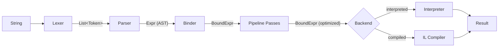
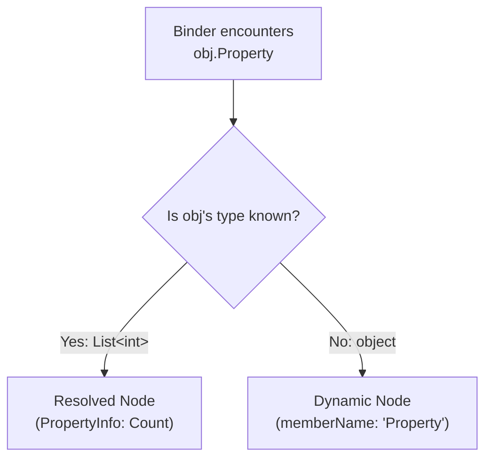

Every expression Alder evaluates passes through a five-stage pipeline that transforms a string into a result. Each stage has a well-defined input, output, and responsibility.

## Stage 1: Lexing

**Input**: `string` (the expression text)
**Output**: `List<Token>`

The lexer scans the source character-by-character and produces a flat token list. Single-pass, no backtracking. Every token carries its position (line, column, offset) for error reporting downstream.

What the lexer handles:
- All C# numeric literal forms: decimal, hex (`0x`), binary (`0b`), digit separators (`_`), suffixes (`L`, `U`, `UL`, `F`, `D`, `M`), leading decimal (`.5`), scientific notation (`1.5e-3`)
- Six string forms: regular, verbatim (`@""`), raw (C# 11 `"""`), interpolated (`$""`), verbatim-interpolated (`$@""` / `@$""`), raw-interpolated (`$"""`)
- C# 11 raw string indentation stripping
- All escape sequences: `\n`, `\r`, `\t`, `\0`, `\a`, `\b`, `\f`, `\v`, `\\`, `\"`, `\'`, `\xHH`, `\uHHHH`, `\UHHHHHHHH`
- Character literals with escape sequences
- All C# operators including multi-character sequences (`??=`, `>>>=`) and Extended mode operators (`<=>`, `..=`, `**`, `|>`)
- Reserved keywords, contextual keywords, and Extended mode keywords (`between`, `like`, `unless`, `until`)
- Single-line (`//`) and multi-line (`/* */`) comments

## Stage 2: Parsing

**Input**: `List<Token>` + `LanguageMode`
**Output**: `Expr` (untyped AST)

The parser uses precedence climbing — a single `ParseSubExpression(minPrecedence)` method with a while-loop. This keeps recursion depth proportional to expression nesting, not the number of precedence levels.

Five mutually-referencing sub-parsers are wired together at construction:

| Parser | Responsibility |
|--------|---------------|
| `ExpressionParser` | Precedence climbing, binary/unary operators, ternary, assignment, `is`/`as`/`switch`, let-in, if-expression |
| `PrimaryParser` | Literals, identifiers, `new`, `typeof`, `sizeof`, `nameof`, `default`, `checked`/`unchecked`, array/object literals, comprehensions, postfix chains (`.`, `?.`, `[]`, `?[]`, `++`, `--`, `()`) |
| `PatternParser` | All ECMA-334 §11.2 patterns: constant, type, relational, and/or/not, property, positional, list, slice, var, discard |
| `StatementParser` | `if`/`else`, `for`, `while`, `do`, `foreach`, `switch`, `try`/`catch`/`finally`, `using`, `lock`, `return`, `break`, `continue`, `goto`, variable declarations, `unless`/`until` (Extended) |
| `QueryParser` | LINQ query syntax: `from`, `where`, `select`, `orderby`, `let`, `join`, `group`, `into` — desugars to method calls |

Key design decisions:
- **LINQ query syntax desugars at parse time.** `from x in source where x > 0 select x` becomes a chain of `CallExpr` nodes calling `Where` and `Select` with `LambdaExpr` arguments. The AST has no query-specific node types.
- **Extended mode features are gated at parse time.** Using `[1, 2, 3]`, `|>`, `**`, `let..in`, chained comparisons, or SQL-style operators in Standard mode produces `ALDR0020`.
- **Disambiguation uses lookahead.** Cast vs grouping (`(int)x` vs `(x + y)`), if-statement vs if-expression, `from` identifier vs `from` query — the parser uses bounded lookahead to resolve ambiguities without backtracking.

## Stage 3: Binding

**Input**: `Expr` (AST) + `BindingContext` (variable types from the engine)
**Output**: `BoundExpr` (typed bound tree)

The binder is the most complex stage. It performs semantic analysis: resolving identifiers, members, and method calls; inferring types for operators; running ECMA-334 overload resolution and generic type inference. Every output node carries a `BoundType` — the binder's best knowledge of what type the expression will produce.

The central design split is **resolved vs dynamic nodes**:

When the binder knows the target type (from `SetVariable<T>`, type inference, or literal types), it produces **resolved** nodes with the exact `MethodInfo`, `PropertyInfo`, or `FieldInfo` already selected. When the type is `object`, it produces **dynamic** nodes that defer member resolution to runtime.

This split has three consequences:
1. **Performance** — resolved nodes skip reflection at runtime
2. **AOT dispatch** — the source generator emits type-safe dispatch code from resolved node metadata
3. **Diagnostics** — the binder reports `CS1061: 'String' does not contain a definition for 'Foo'` at bind time instead of failing at runtime

See [Binder](binder.md) for the full binding process.

## Stage 4: Optimization Passes

**Input**: `BoundExpr` (from binder)
**Output**: `BoundExpr` (optimized, security-validated)

The bound tree passes through a configurable pipeline of transformation passes. The interpretation pipeline runs three passes; the compilation pipeline adds a fourth:

1. **SecurityValidationPass** — walks every node against the sandbox policy. If any node violates a permission, evaluation never starts.
2. **ConstantFoldingPass** — evaluates compile-time constant subexpressions (`1 + 2` → `3`, `"hello" + " world"` → `"hello world"`)
3. **DeadBranchEliminationPass** — removes unreachable `if` branches when conditions have been folded to constants
4. **ConversionInsertionPass** *(compilation only)* — inserts explicit cast nodes for numeric type promotions, because LINQ expression trees require exact type matching

See [Bound Tree Pipeline](bound-tree-pipeline.md) for details on each pass.

## Stage 5: Execution

### Interpreter

**Input**: `BoundExpr` (optimized)
**Output**: `object?` (the result)

The interpreter walks the bound tree node by node using a per-node strategy pattern. Each bound node kind has a dedicated evaluator class, with dispatch source-generated at compile time — a flat switch expression mapping each node kind to its handler, with no virtual method overhead.

Numeric operations use pre-built delegate tables keyed by type pairs — `1 + 2` evaluates without boxing, `dynamic`, or reflection. Control flow uses signal propagation — `break`, `continue`, and `return` produce signal values that flow through the evaluation stack, unwrapped only at function boundaries.

See [Interpreter](interpreter.md) for details.

### Compiler

**Input**: `BoundExpr` (optimized, with conversion insertion applied)
**Output**: `CompiledExpressionDelegate` (native delegate)

The compiler translates the bound tree into a `System.Linq.Expressions.Expression` tree, then compiles it to a native delegate. The compiled delegate captures the engine's context by reference — variables set after compilation are visible to subsequent invocations.

Key optimizations: **local promotion** converts context-based variable lookups (dictionary access) into typed LINQ locals (register/stack variables), and **identifier hoisting** pre-loads frequently-accessed engine variables into typed locals at the start of the compiled body.

The compiler backend is swappable via `IExpressionCompiler`. See [Compiler](compiler.md) for details.

## Caching

Caching happens at three levels, each avoiding redundant work:

| Level | What's cached | Invalidation |
|-------|-------------|-------------|
| Parsed AST | `Expr` tree on `AlderExpression` | Never — the AST is immutable |
| Bound tree | `BoundExpr` per context on `AlderExpression` | When variable types change (tracked by a version counter) |
| Compiled delegate | Native delegate on `AlderExpression` + per-engine cache | FIFO eviction in the engine cache |

The bound tree cache is the most impactful: when you call `Evaluate(AlderExpression)` repeatedly with the same variable types, binding is skipped entirely — only execution runs. The engine tracks a type inference version that increments when `SetVariable<T>` changes a variable's type. If the version matches the cached version, the bound tree is reused.

## AOT Integration

When AOT dispatch is available (via the source generator), the engine checks it before falling back to reflection at every member access and method call. The dispatch lookup walks the type hierarchy — registering dispatch for `List<int>` covers access to members inherited from `IList<int>`, `ICollection<int>`, etc.

See [AOT Overview](../aot/overview.md) for the source generator documentation.
