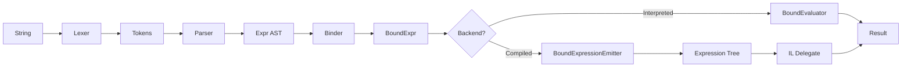
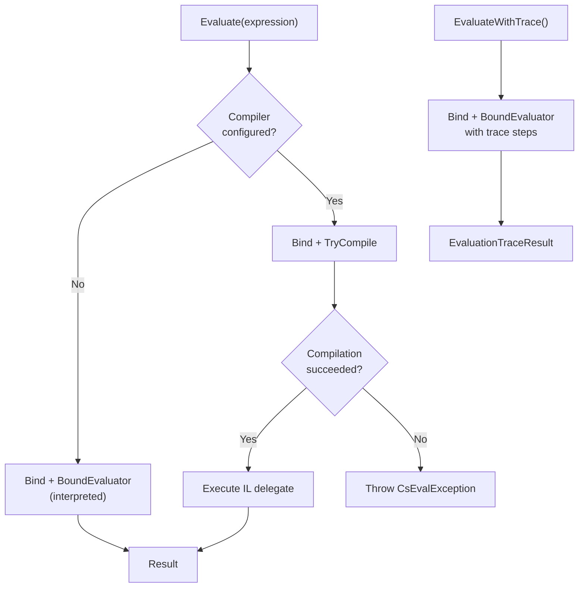
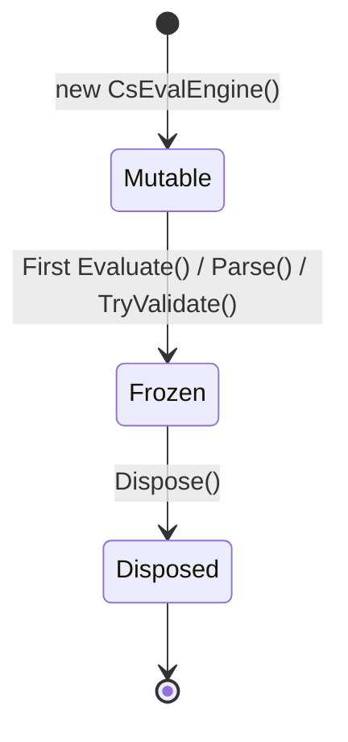
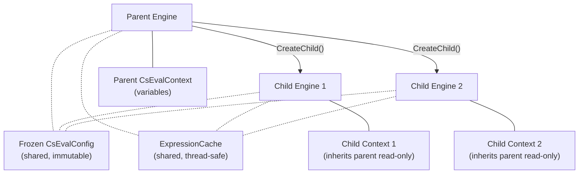

## Overview

CsEval processes expressions through a multi-stage pipeline inspired by the Roslyn compiler architecture. An expression string flows through four stages -- **Lex**, **Parse**, **Bind**, **Execute** -- before producing a result. Two execution backends are available: a tree-walking interpreter (built-in) and an IL compiler (via the CsEval.Compiled package).

## Pipeline Stages

Every expression passes through these stages in order:

### Lexing

The `Lexer` tokenizes the input string into a `List<Token>`. Each token carries its type, lexeme text, and source position (line/column). The lexer handles all C# literal forms including string interpolation, verbatim strings, and numeric suffixes.

**Source:** `src/CsEval/Parsing/Lexer.cs`

### Parsing

`ExpressionParser` uses Pratt-style recursive descent to parse the token stream into an untyped `Expr` AST. The parser is split across several focused classes: `PrimaryParser` (literals, identifiers, invocations), `PatternParser` (is/switch patterns), `StatementParser` (blocks, loops, control flow), and `QueryParser` (LINQ query syntax). The result is an abstract record hierarchy with ~70 node types.

**Source:** `src/CsEval/Parsing/ExpressionParser.cs`

### Binding

`Binder.Bind()` traverses the untyped `Expr` tree and produces a typed `BoundExpr` tree with ~65 node types. During binding, the binder resolves types via `TypeResolver`, validates operators, resolves overloads via `CallBinderService` and `MemberBinderService`, and attaches a `StaticType` to every node.

Sandbox permission checks are enforced during binding and evaluation. `TryValidate()` runs the lexer, parser, and binder without executing, returning structured `CsEvalDiagnostic` records.

**Source:** `src/CsEval/Binding/Binder.cs`

### Execution

The bound tree is dispatched to one of two backends based on the engine configuration.

**Interpreted (default):** `BoundEvaluator.Evaluate()` tree-walks the `BoundExpr` nodes via a large switch dispatch, calling into runtime helpers (`IdentifierRuntime`, `AssignmentRuntime`, `ConstructionRuntime`, `PatternRuntime`, etc.) for complex operations. The result is an `object?`.

**Compiled (opt-in via UseCompiler()):** `BoundExpressionEmitter` converts the `BoundExpr` tree into a `System.Linq.Expressions.Expression` tree. The LINQ expression tree is then compiled to an IL delegate via `Expression<T>.Compile()`. The compiled delegate is cached for subsequent invocations.

**Sources:** `src/CsEval/Interpretation/BoundEvaluator.cs`, `src/CsEval.Compiled/Compilation/BoundExpressionEmitter.cs`

## Execution Backend Selection

The engine selects the execution backend based on whether a compiler is configured via `UseCompiler()` on `CsEvalOptions`.

Key behaviors:

- **No compiler (default):** The engine always uses `BoundEvaluator` for tree-walking interpretation.
- **Compiler configured (`UseCompiler()`):** The engine attempts IL compilation. If compilation fails, it throws `CsEvalException` rather than falling back to interpretation.
- **`EvaluateWithTrace()`:** Always uses the interpreted pipeline regardless of compiler configuration. Tracing requires step-by-step interpretation to capture each `EvaluationTraceStep`.

## Engine Lifecycle

A `CsEvalEngine` transitions through three states. Once frozen, configuration is immutable and the engine is thread-safe for concurrent evaluation.

### Mutable

After construction, the engine accepts configuration calls:

- `SetVariable()` / `SetVariable<T>()` / `SetVariables()`
- `RegisterFunction()`
- `RegisterModule()` / `RegisterFromType()`
- `RegisterAssembly()` / `RegisterNamespace()`
- `RegisterExtensionMethods()`
- `UseGeneratedContext()`

### Frozen

The first call to `Evaluate()`, `Parse()`, or `TryValidate()` freezes the engine. Internally, `GetOrCreateConfig()` builds an immutable `CsEvalConfig` snapshot and stores it via `Interlocked.CompareExchange`. After freezing:

- Registration methods (`RegisterFunction`, `RegisterModule`, `RegisterAssembly`, `RegisterNamespace`, `RegisterExtensionMethods`) throw `InvalidOperationException`.
- `SetVariable()` **continues to work** after freeze -- it defines or updates variables on the live `CsEvalContext`.
- `Evaluate()`, `Parse()`, `TryValidate()`, `EvaluateWithTrace()` are all thread-safe.

### Disposed

`Dispose()` clears the expression cache and type metadata. Further API calls throw `ObjectDisposedException`.

## Expression Caching

The engine maintains a FIFO-bounded `ExpressionCache` (capacity: 10,000 entries) backed by `ConcurrentDictionary`. When the cache reaches capacity, the oldest entries are evicted.

`CsEvalExpression` wraps a parsed `Expr` AST for reuse. Calling `Parse()` returns a `CsEvalExpression` that can be passed to `Evaluate()` multiple times with different variable values, avoiding repeated lexing and parsing.

Bound expressions are cached per-context via `ConditionalWeakTable`, so re-evaluation with the same context skips re-binding.

When the compiled backend is active, compiled IL delegates are also stored in the expression cache, keyed by expression text.

## Child Engines

`CreateChild()` produces a new engine that shares the parent's frozen `CsEvalConfig` and `ExpressionCache` while maintaining isolated variable scope.

- The child engine's `CsEvalContext` is created via `parentContext.CreateChild()` -- it inherits parent variables read-only.
- Variables set on a child do not leak to the parent or siblings.
- Per-invocation variables (dictionary parameter to `Evaluate()`) create a temporary child engine with its own child context.
- Use case: per-request isolation in server scenarios while sharing the expensive frozen config and compiled delegate cache.

## Key Abstractions

| Abstraction | Purpose |
|---|---|
| `Expr` | Untyped AST. Abstract record hierarchy (~70 node types) produced by the parser. |
| `BoundExpr` | Typed AST. Abstract record with `StaticType` (~65 node types) produced by the binder. |
| `CsEvalEngine` | User-facing facade. Owns lifecycle, expression caching, child engine creation. |
| `CsEvalConfig` | Immutable frozen configuration snapshot. Shared across threads and child engines. |
| `CsEvalContext` | Scoped variable store. Forms a parent/child hierarchy per evaluation scope. |
| `CsEvalExpression` | Pre-parsed expression handle. Wraps `Expr` AST for reuse across evaluations. |
| `ControlFlowSignal` | Value object for `return`/`break`/`continue`/`goto`. Not an exception -- avoids SEH overhead and prevents user `catch` blocks from intercepting control flow. |

## See Also

- [Compilation Modes](/engine/compilation-modes/) -- interpreted vs compiled backends, CsEval.Compiled extension methods
- [Thread Safety](/engine/thread-safety/) -- concurrency guarantees and child engines
- [Options](/engine/options/) -- CsEvalOptions configuration
