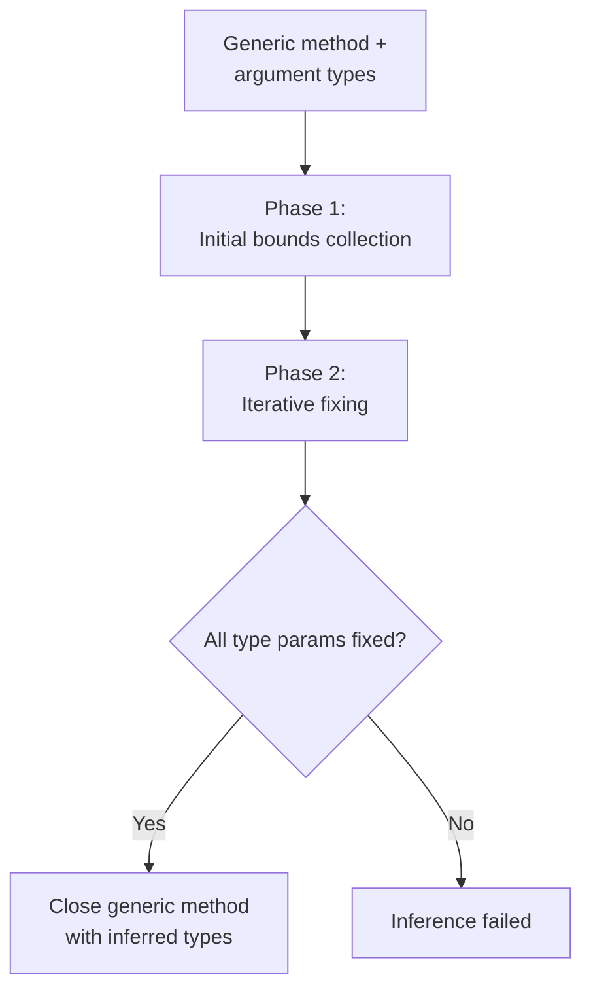

Alder implements ECMA-334 §12.6.3 generic method type inference. This is the algorithm that makes `items.Select(x => x.Name)` work without writing `items.Select<Item, string>(x => x.Name)`: the type arguments `Item` and `string` are inferred from the argument types and the lambda body.

## Algorithm Overview

Type inference runs when a generic method is called without explicit type arguments. It determines the type arguments by analyzing the relationship between argument types and parameter types.

## Phase 1: Initial Bounds Collection (§12.6.3.2)

For each argument-parameter pair, the inference engine adds bounds to unfixed type parameters:

| Inference kind | When used |
|---------------|-----------|
| Lower-bound inference | Standard: argument type constrains parameter type from below |
| Exact inference | Invariant generic positions, array elements of value types |
| Upper-bound inference | Contravariant generic positions |
| Explicit parameter type inference | Lambda arguments with explicit parameter types |

### Variance-aware propagation

When the parameter type is generic (e.g., `IEnumerable<T>`), the engine finds the matching constructed type in the argument's hierarchy and propagates bounds through the generic arguments, respecting variance:

| Variance | Inference direction |
|----------|-------------------|
| Covariant (`out`) | Lower-bound inference on the type argument |
| Contravariant (`in`) | Upper-bound inference on the type argument |
| Invariant (default) | Exact inference on the type argument |

Example: For `Func<in T, out TResult>`, when inferring from `Func<string, int>`:
- `T` (contravariant): upper-bound: T must be a supertype of `string`
- `TResult` (covariant): lower-bound: TResult must be a subtype of `int`

### Special cases

- **Nullable types**: `Nullable<U>` vs `Nullable<V>` → infer between `U` and `V`
- **Array types**: Same rank required. Value-type elements use exact inference, reference-type elements use lower-bound inference
- **Alder lambdas**: Don't have explicit parameter types (they're dynamically typed), so explicit parameter type inference adds no bounds. Lambda return types are inferred in Phase 2

## Phase 2: Iterative Fixing (§12.6.3.3)

The fixing loop runs up to `2 * genericParamCount + 1` iterations. Each iteration tries to fix unfixed type parameters in priority order:

**Round 1. Independent parameters**: Fix type parameters that have no dependencies on other unfixed parameters. A dependency exists when a parameter type contains both the current type parameter and another unfixed one, and the corresponding argument is a lambda (creating a data dependency through the lambda's return type).

**Round 2. Depended-on parameters**: If Round 1 made no progress, fix parameters that are depended on by others. This breaks cycles by prioritizing parameters that unblock others.

**Round 3. Anything with bounds**: Last resort: fix any unfixed parameter that has at least one bound.

### Lambda return type inference

After each iteration that fixes new type parameters, the engine checks for lambda arguments whose input type parameters are now all fixed. For those lambdas:

1. Substitute the fixed types into the delegate's input parameter types
2. Evaluate the lambda body with those input types using Alder's own engine
3. Add the inferred return type as a lower bound on the delegate's return type parameter

This is the mechanism that infers `TResult = string` from `items.Select(x => x.Name)`. after `T = Item` is fixed, the lambda `x => x.Name` is evaluated with `x: Item`, producing return type `string`.

## Fixing a Type Parameter (§12.6.3.12)

To fix type parameter `T`:

1. **Candidate set** = union of exact bounds, lower bounds, and upper bounds
2. **Intersect with exact bounds**: If any exist, keep only candidates that appear in the exact set
3. **Filter by lower bounds**: Remove candidates that don't accept an implicit conversion FROM every lower bound
4. **Filter by upper bounds**: Remove candidates that don't accept an implicit conversion TO every upper bound
5. **Select unique best**: Find the unique candidate `V` such that all others convert to `V`. If no unique best exists, fixing fails.

## Type Hierarchy Search

When matching a generic parameter type (like `IEnumerable<T>`) against an argument type, the engine searches the argument's type hierarchy: the type itself, all implemented interfaces, and the base type chain, for a unique implementation of the generic definition. If multiple implementations exist (e.g., `IEnumerable<int>` and `IEnumerable<string>`), inference produces no bounds for that argument.

## Integration with Overload Resolution

Type inference runs during candidate construction in overload resolution. If inference succeeds, the generic method is closed with the inferred types and enters the standard applicability checking pipeline. If inference fails, the method is not a candidate.

See [Overload Resolution](overload-resolution.md) for the full pipeline.
