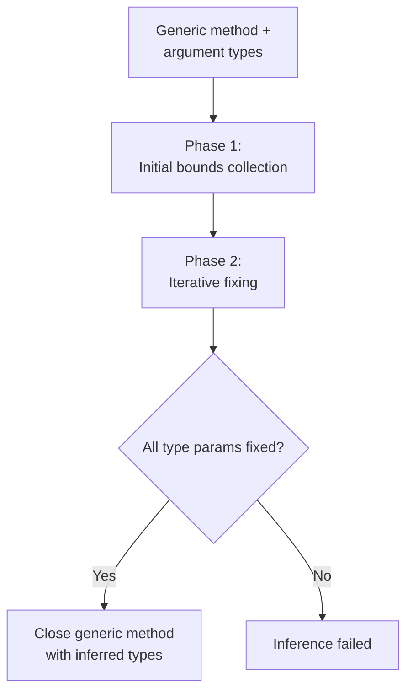

Alder implements ECMA-334 §12.6.3 generic method type inference. This is the algorithm that makes `items.Select(x => x.Name)` work without writing `items.Select<Item, string>(x => x.Name)` — the type arguments `Item` and `string` are inferred from the argument types and the lambda body.


## Algorithm Overview

Type inference runs when a generic method is called without explicit type arguments. It determines the type arguments by analyzing the relationship between argument types and parameter types.



## Phase 1: Initial Bounds Collection (§12.6.3.2)

For each argument-parameter pair, the inference engine analyzes the relationship and adds bounds to the unfixed type parameters:

| Inference kind | When used | ECMA-334 section |
|---------------|-----------|-----------------|
| `LowerBoundInference(argType, paramType)` | Standard: argument type constrains parameter type from below | §12.6.3.10 |
| `ExactInference(argType, paramType)` | Invariant generic positions, array elements of value types | §12.6.3.9 |
| `UpperBoundInference(argType, paramType)` | Contravariant generic positions | §12.6.3.11 |
| `ExplicitParameterTypeInference(lambda, paramType)` | Lambda arguments with explicit parameter types | §12.6.3.2 |

### Bounds propagation through generic types

When `paramType` is a generic type (e.g., `IEnumerable<T>`), the inference engine finds the matching constructed type in the argument's type hierarchy and propagates bounds through the generic arguments, respecting variance:

| Variance of type parameter | Inference direction |
|---------------------------|-------------------|
| Covariant (`out`) | `LowerBoundInference` on the type argument |
| Contravariant (`in`) | `UpperBoundInference` on the type argument |
| Invariant (default) | `ExactInference` on the type argument |

Example: For `Func<in T, out TResult>`, when inferring from `Func<string, int>`:
- `T` (contravariant): `UpperBoundInference(string, T)` — T must be a supertype of string
- `TResult` (covariant): `LowerBoundInference(int, TResult)` — TResult must be a subtype of int

### Special cases

- **Nullable types**: `Nullable<U>` vs `Nullable<V>` → infer between `U` and `V`
- **Array types**: Same rank required. Value-type elements use `ExactInference`, reference-type elements use `LowerBoundInference`
- **Alder lambdas**: Do not have explicit parameter types (they're dynamically typed), so `ExplicitParameterTypeInference` adds no bounds. Lambda return types are inferred in Phase 2 via output type inference.

## Phase 2: Iterative Fixing (§12.6.3.3)

The fixing loop runs up to `2 * genericParamCount + 1` iterations. Each iteration:

### Round 1: Fix unfixed params with no dependencies on other unfixed params

A type parameter `T` depends on another unfixed parameter `U` if `U` appears in a parameter type that also contains `T` and the corresponding argument is a lambda. This creates a data dependency: `T`'s bounds depend on the lambda's return type, which depends on `U` being fixed first (so the lambda can be evaluated with `U`'s concrete type).

If `T` has no such dependencies and has at least one bound, attempt to fix it.

### Round 2: Fix unfixed params that are depended on by others

If Round 1 made no progress, try fixing params that have bounds and are depended on by other unfixed params. This breaks cycles by prioritizing params that unblock others.

### Round 3: Fix anything with bounds

Last resort — fix any unfixed param that has at least one bound.

### Output type inference for lambdas

After each iteration that fixes new type parameters, the engine checks if any lambda arguments now have all their input type parameters fixed. If so, it:

1. Substitutes the fixed types into the delegate's input parameter types
2. Creates `BoundType[]` from the substituted types
3. Calls `ExtensionMethodResolver.InferLambdaReturnType(lambda, inputTypes, context)` — which evaluates the lambda body with those input types using Alder's own evaluator
4. Adds the inferred return type as a lower bound on the delegate's return type parameter

This is the mechanism that infers `TResult = string` from `items.Select(x => x.Name)` — after `T = Item` is fixed, the lambda `x => x.Name` is evaluated with `x: Item`, producing return type `string`.

## Fixing a Type Parameter (§12.6.3.12)

To fix type parameter `T` at index `i`:

1. **Candidate set** = union of `ExactBounds[i]`, `LowerBounds[i]`, `UpperBounds[i]`
2. **Intersect with exact bounds**: If any exact bounds exist, keep only candidates that appear in the exact set
3. **Filter by lower bounds**: Remove candidates that don't have an implicit conversion FROM every lower bound
4. **Filter by upper bounds**: Remove candidates that don't have an implicit conversion TO every upper bound
5. **Select unique best**: Find the unique candidate `V` such that all other candidates convert to `V`. If no unique best exists, fixing fails.

If fixing succeeds, `FixedTypes[i] = best` and `IsFixed[i] = true`.

## `FindUniqueConstructedType`

When matching a generic parameter type (like `IEnumerable<T>`) against an argument type, the engine searches the argument's type hierarchy for a unique implementation of the generic definition:

1. Check the type itself
2. Check all implemented interfaces
3. Walk the base type chain

If multiple implementations of the same generic definition are found (e.g., a type implementing both `IEnumerable<int>` and `IEnumerable<string>`), the match is not unique and inference produces no bounds for that argument.

## Integration with Overload Resolution

Type inference is invoked by `OverloadResolver.TryCloseGenericMethod` during candidate construction:

```csharp
var inferred = TypeInference.Infer(genericMethod, argTypes, lambdaArgs, context);
if (inferred == null)
    return null; // method not a candidate
return RuntimeGenericFactory.TryCloseGenericMethod(genericMethod, inferred, out var closed)
    ? closed : null;
```

If inference succeeds, `RuntimeGenericFactory.TryCloseGenericMethod` calls `genericMethod.MakeGenericMethod(inferred)` to produce the closed method, which then enters the standard applicability checking pipeline.
