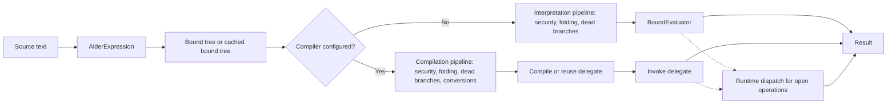

# Architecture

Alder is an embeddable C# expression engine built around one compiler-style semantic pipeline and two execution mechanisms. Source text is parsed into syntax, bound against the active context, validated under the configured security policy, optimized, and then evaluated by either the interpreter or the compiled backend. Backend selection changes the execution mechanism. It does not define a second language.

For exact lifecycle rules, cache boundaries, and error propagation, use [Execution model](../reference/execution-model.md). For production operating patterns, use [Execution and reuse](../operations/execution-and-reuse.md).

The bound tree is Alder's architectural boundary. Everything before that boundary determines what the expression means: types, conversions, overloads, member targets, assignment legality, control-flow shape, and the points where runtime dispatch is still required. Everything after that boundary executes those decisions while preserving Alder's security policy and execution constraints.

## Semantic pipeline

Alder evaluation proceeds through these stages:

1. Parse source text into Alder syntax.
2. Bind syntax into a semantic tree against the current context.
3. Select the execution path from engine configuration.
4. Run the backend-appropriate validation and preparation passes.
5. Execute through the interpreter or a cached compiled delegate.
6. Unwrap final control-flow state at the evaluation boundary.

The binder is the semantic center of the system. When static information is sufficient, it resolves calls, members, indexes, conversions, and construct legality before execution begins. When the declared type surface is deliberately open, such as `object`-typed values or runtime-shaped members, the binder records a dynamic operation and leaves final selection to runtime dispatch.

That split lets Alder be precise without requiring every host integration to be statically closed. Strongly typed contexts produce earlier diagnostics and more reusable bound artifacts. Open contexts preserve runtime flexibility while moving more work into dispatch.

## Execution mechanisms

The interpreter evaluates the bound tree directly. It is the default synchronous path and the path used by `EvaluateAsync(...)`.

The compiled backend lowers the same bound tree to a reusable delegate through `System.Linq.Expressions`. When an engine is configured with `UseCompiler()`, synchronous `Evaluate(...)` uses that delegate path and recompiles when the relevant type surface changes.

Both mechanisms share Alder's parser, binder, validation pipeline, security policy, execution limits, and language semantics. Divergence between them is a defect in an execution path, not a separate contract.

`EvaluateAsync(...)` uses the interpreter because `System.Linq.Expressions` does not provide the async execution model Alder requires. Alder's async path awaits expression-level asynchronous work directly inside the evaluated tree.

## Runtime dispatch

Runtime dispatch is the counterpart to resolved binding. It handles operations whose final target depends on runtime values, including object-shaped variables, dynamic member access, late-selected overloads, and registered module or function calls.

Generated typed dispatch participates in that runtime layer. When AOT metadata is registered, Alder tries typed dispatch for covered operations and falls back to reflection-based dispatch when the typed path declines a shape. The generated path improves deployment characteristics for NativeAOT, IL2CPP-style environments, and trimmed applications. It does not alter parsing, binding, overload resolution, security policy, or execution limits.

## Configuration surfaces

Host integration is expressed through `AlderOptions` before engine construction:

- modules expose named object or type surfaces
- functions expose global call sites
- type registration controls type lookup and extension-method discovery
- AOT registration contributes generated dispatch metadata
- a service provider resolves module instances
- security policy and constraint options define authority and runtime limits
- compiler configuration enables compiled synchronous execution

The engine materializes those options into an immutable runtime configuration. Contexts created by the engine share that configuration while carrying their own variable state.

Dynamic LINQ sits above the same semantic pipeline. Its predicates, selectors, keys, joins, projections, provider exports, and query plans are bound fragments adapted into LINQ operators, delegates, or expression trees. That makes query composition another integration surface over the same parser, binder, security policy, diagnostics, and backend boundaries.

## Reuse and invalidation

Alder caches parsed, bound, pipeline, and compiled artifacts where reuse is semantically valid. The critical invalidation signal is the visible declared-type surface of the context. Value-only changes can often reuse prior work. Adding a variable or changing a declared type forces rebinding because overload resolution, conversion legality, and the resolved-versus-dynamic boundary may change.

Compiled delegates follow the same rule. Normal synchronous evaluation recompiles when the compiled artifact is stale. Explicit compiled wrappers capture the type version at compilation time and reject invocation after a type-surface change.

## Security and constraints

Security policy and execution constraints are separate runtime controls. The security policy validates whether operations such as calls, construction, reads, writes, and metadata access are allowed. Execution constraints bound work through statement counts, loop iteration counts, timeouts, cancellation, and collection-size checks.

Those controls live in the shared pipeline and runtime support code, so they apply to interpreted execution, compiled synchronous execution, and generated dispatch paths.

## Design tradeoffs

Alder's architecture deliberately concentrates semantic decisions before execution. That gives the system stable diagnostics, backend parity, reusable artifacts, and a clear place to enforce language rules. The cost is discipline: binding bugs affect both backends, dynamic dispatch must remain semantically aligned with resolved binding, and cache reuse has to prefer correctness over hit rate.

## Related pages

- [Binding system](./binding-system.md)
- [Execution and reuse](../operations/execution-and-reuse.md)
- [AOT and generated dispatch](../operations/aot-and-generated-dispatch.md)
- [Execution model](../reference/execution-model.md)
- [Standard mode language support](../reference/language/standard-mode-language-support.md)
