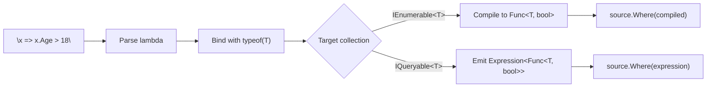

LINQ Dynamic extends every `IEnumerable<T>` and `IQueryable<T>` with string-based operations. Write the lambda as a string — Alder parses it, binds it with full type information from `T`, infers generic type arguments, resolves overloads, and compiles it to a native delegate or a provider-transparent expression tree.

This means any collection in your application becomes dynamically queryable at runtime. User-defined filters in a dashboard. Configuration-driven business rules. Admin panels where operators write their own predicates. Report builders where users choose projections and groupings. All with full C# lambda syntax, full type safety from `T`, and the same ECMA-334 semantics as hand-written LINQ.

## In-Memory Collections

On `IEnumerable<T>`, LINQ Dynamic compiles string lambdas to native `Func<T, ...>` delegates and invokes them per element — same performance as hand-written LINQ after the one-time compilation cost.

```csharp
AlderEval.Configure(o => o.UseCompiler());

var people = new List<Person>
{
    new("Alice", 30, "Engineering", 120_000),
    new("Bob", 25, "Marketing", 85_000),
    new("Charlie", 35, "Engineering", 140_000),
};

// Filter
var engineers = people.WhereDynamic("x => x.Department == \"Engineering\"");

// Project
var names = people.SelectDynamic<Person, string>("x => x.Name");

// Order
var bySalary = people.OrderByDescendingDynamic<Person, decimal>("x => x.Salary");

// Group
var byDept = people.GroupByDynamic<Person, string>("x => x.Department");

// Aggregate
var totalSalary = people.SumDynamic("x => x.Salary");
var avgAge = people.AverageDynamic("x => (double)x.Age");

// Quantify
var anyUnder30 = people.AnyDynamic("x => x.Age < 30");

// Element access
var firstEngineer = people.FirstDynamic("x => x.Department == \"Engineering\"");
```

<!-- test: Compilation_LinqDynamic -->

The string is parsed once and compiled to IL. Subsequent evaluations of the same string reuse the cached delegate.

## Database Queries — IQueryable

On `IQueryable<T>`, LINQ Dynamic produces `Expression<Func<T, ...>>` trees instead of compiled delegates. EF Core and other LINQ providers translate these expression trees to SQL — the string predicate becomes a database query.

```csharp
// Produces SQL: SELECT * FROM People WHERE Age >= 18
var adults = dbContext.People.WhereDynamic("x => x.Age >= 18");

// Produces SQL: SELECT Name FROM People
var names = dbContext.People.SelectDynamic<Person, string>("x => x.Name");

// Produces SQL: SELECT * FROM People ORDER BY LastName
var sorted = dbContext.People.OrderByDynamic<Person, string>("x => x.LastName");

// Produces SQL: SELECT Department, COUNT(*) FROM People GROUP BY Department
var grouped = dbContext.People.GroupByDynamic<Person, string>("x => x.Department");
```

The expression trees are provider-transparent — they contain standard `System.Linq.Expressions` nodes with no Alder runtime dependencies. Any LINQ provider that works with `Expression<Func<T, ...>>` works with LINQ Dynamic.

## Configuration

LINQ Dynamic uses the global `AlderEval` engine. Configure it once at application startup:

```csharp
AlderEval.Configure(o => o.UseCompiler());
```

This is a one-time call. `AlderEval.Configure` can only be called once and must be called before the first LINQ Dynamic operation. All LINQ Dynamic calls across the application share the same engine and compiled delegate cache.

If the compiler isn't configured, `InvalidOperationException` is thrown with a clear message: `"LINQ Dynamic methods require a compiler. Call AlderEval.Configure(o => o.UseCompiler()) before using WhereDynamic, SelectDynamic, etc."`

## How It Works



For `IEnumerable<T>`:
1. Parse the string as a lambda via `ParseAsExpression<Func<T, TResult>>`
2. Compile the expression tree to a native delegate via `.Compile()`
3. Pass the delegate to the standard LINQ method

For `IQueryable<T>`:
1. Parse the string as a lambda via `ParseAsExpression<Func<T, TResult>>`
2. Pass the expression tree directly to the queryable LINQ method
3. The LINQ provider (EF Core, etc.) translates it to SQL

In both cases, Alder's binder has full access to `T`'s members — `x.Age`, `x.Department`, `x.Salary` are resolved against the actual type at bind time, with proper diagnostics if a member doesn't exist.

## Available Methods

### IEnumerable\<T\> and IQueryable\<T\>

These methods have overloads for both in-memory collections and database queries:

| Category | Methods |
|----------|---------|
| **Filtering** | `WhereDynamic` |
| **Projection** | `SelectDynamic` |
| **Ordering** | `OrderByDynamic`, `OrderByDescendingDynamic`, `ThenByDynamic`, `ThenByDescendingDynamic` |
| **Grouping** | `GroupByDynamic` |
| **Quantifiers** | `AnyDynamic`, `AllDynamic` |
| **Element access** | `FirstDynamic`, `FirstOrDefaultDynamic` |
| **Counting** | `CountDynamic` |
| **Aggregation** | `SumDynamic`, `AverageDynamic`, `MinDynamic`, `MaxDynamic` |

### IEnumerable\<T\> Only

These methods are available for in-memory collections only:

| Category | Methods |
|----------|---------|
| **Grouping** | `DistinctByDynamic` |
| **Element access** | `LastDynamic`, `LastOrDefaultDynamic`, `SingleDynamic`, `SingleOrDefaultDynamic` |

## Lambda Syntax

LINQ Dynamic lambdas use the same C# lambda syntax as `ParseAsExpression<TDelegate>`. The lambda is always parsed in Standard mode regardless of the engine's `LanguageMode` setting.

```csharp
// Single parameter — inferred from T
"x => x.Age >= 18"

// Member access chains
"x => x.Address.City == \"London\""

// Method calls on members
"x => x.Name.StartsWith(\"A\")"

// Arithmetic
"x => x.Price * x.Quantity"

// Ternary
"x => x.Status == \"Active\" ? x.Balance : 0"

// Null-conditional
"x => x.Manager?.Name ?? \"No Manager\""
```

The full C# expression syntax is available in the lambda body — LINQ, pattern matching, string interpolation, and everything documented in the [Standard Mode Language Reference](../language/standard.md) (except statements, loops, and variable declarations, which are not valid in expression trees).
