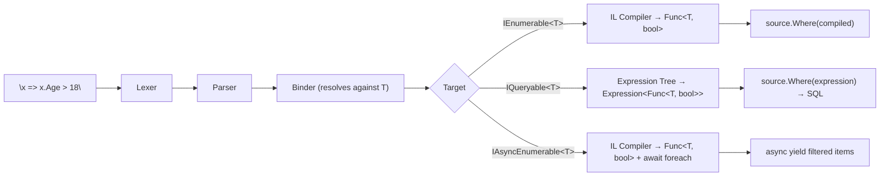

# LINQ Dynamic

LINQ Dynamic brings the full power of the C# language to runtime string queries. Every `IEnumerable<T>`, `IQueryable<T>`, and `IAsyncEnumerable<T>` gains string-based query methods that parse, bind, and compile real C# lambda expressions — with full type safety from `T`, ECMA-334 semantics, and compiler-grade diagnostics.

The expressions are real C# — ternary operators, null coalescing, `Math.Round`, `String.Contains`, nested LINQ chains, type casts, complex boolean logic. The binder resolves every member access against `T` at bind time. The compiler emits native IL. The result is a LINQ pipeline that runs at compiled speed and translates cleanly to SQL through any LINQ provider.

## Quick Start

```csharp
AlderEval.Configure(o => o.UseCompiler());

var products = GetProducts();

// Filter with a string predicate — real C# inside
var expensive = products.WhereDynamic("p => p.Price > 100m");

// Inline variables — pass values directly, reference as @0, @1
var filtered = products.WhereDynamic("p => p.Price > @0 && p.Category == @1", 50m, "Electronics");

// Named variables via anonymous objects
var result = products.WhereDynamic("p => p.Price > threshold", new { threshold = 100m });

// Custom engine — no global singleton required
using var engine = new AlderEngine(o => o.UseCompiler());
var sorted = products.OrderByDynamic<Product, decimal>(engine, "p => p.Price");
```

## In-Memory Collections (IEnumerable)

On `IEnumerable<T>`, LINQ Dynamic compiles string lambdas to native `Func<T, ...>` delegates via IL emission. After the one-time compilation, execution matches hand-written LINQ.

```csharp
var people = new List<Person>
{
    new("Alice", 30, "Engineering", 120_000m),
    new("Bob", 25, "Marketing", 85_000m),
    new("Charlie", 35, "Engineering", 140_000m),
};

// Filter
var engineers = people.WhereDynamic("x => x.Department == \"Engineering\"");

// Project
var names = people.SelectDynamic<Person, string>("x => x.Name");

// Order
var bySalary = people.OrderByDescendingDynamic<Person, decimal>("x => x.Salary");

// Group
var byDept = people.GroupByDynamic<Person, string>("x => x.Department");

// Aggregate
var totalSalary = people.SumDynamic("x => x.Salary");
var avgAge = people.AverageDynamic("x => (double)x.Age");

// Quantify
var anyUnder30 = people.AnyDynamic("x => x.Age < 30");

// Element access
var firstEngineer = people.FirstDynamic("x => x.Department == \"Engineering\"");
```

## Database Queries (IQueryable)

On `IQueryable<T>`, LINQ Dynamic produces `Expression<Func<T, ...>>` trees. EF Core and any LINQ provider translate these to SQL — the expression trees contain standard `System.Linq.Expressions` nodes with zero Alder runtime dependencies.

```csharp
// SQL: SELECT * FROM People WHERE Age >= 18
var adults = dbContext.People.WhereDynamic("x => x.Age >= 18");

// SQL: SELECT * FROM People WHERE Age > @p0 AND Department = @p1
var filtered = dbContext.People.WhereDynamic(
    "x => x.Age > @0 && x.Department == @1", 25, "Engineering");

// SQL: SELECT Name FROM People
var names = dbContext.People.SelectDynamic<Person, string>("x => x.Name");

// SQL: SELECT * FROM People ORDER BY LastName
var sorted = dbContext.People.OrderByDynamic<Person, string>("x => x.LastName");

// Chain with EF Core async — WhereDynamic produces the expression tree, ToListAsync executes
var results = await dbContext.People
    .WhereDynamic("x => x.IsActive && x.Age > @0", 30)
    .ToListAsync();
```

## Async Streams (IAsyncEnumerable)

LINQ Dynamic extends `IAsyncEnumerable<T>` with the same query methods. Async streams from gRPC, Channels, database cursors, or any async source become dynamically queryable.

```csharp
// Filter an async stream
await foreach (var order in orderStream.WhereDynamic("o => o.Total > @0", 100m))
    await ProcessAsync(order);

// Project an async stream
await foreach (var name in customerStream.SelectDynamic<Customer, string>("c => c.Name"))
    Console.WriteLine(name);

// Async aggregation — returns ValueTask
var count = await eventStream.CountDynamic("e => e.Severity == @0", "Critical");
var hasAny = await sensorStream.AnyDynamic("s => s.Temperature > @0", 100.0);
var first = await logStream.FirstDynamic("l => l.Level == @0", "Error");

// Chain operations on async streams
await foreach (var name in orderStream
    .WhereDynamic("o => o.Status == @0", "Shipped")
    .SelectDynamic<Order, string>("o => o.CustomerName"))
{
    await NotifyAsync(name);
}
```

Streaming methods (`WhereDynamic`, `SelectDynamic`) return `IAsyncEnumerable<T>` and compose naturally. Terminal methods (`AnyDynamic`, `CountDynamic`, `FirstDynamic`, `SumDynamic`, etc.) return `ValueTask<T>` for zero-allocation fast-path execution.

## Inline Variables

Pass values directly into expressions using `@0`, `@1`, `@2`, etc. Variables are injected at compilation time and participate in type inference — they're real variables in the expression, bound and type-checked like any other identifier.

```csharp
// Positional variables
products.WhereDynamic("p => p.Price > @0 && p.Category == @1", 50m, "Electronics");

// Named variables via anonymous objects
products.WhereDynamic("p => p.Price > minPrice", new { minPrice = 50m });

// Mixed — positional and named in the same call
products.WhereDynamic(
    "p => p.Price > @0 && p.Category == category",
    50m, new { category = "Electronics" });

// Dictionary variables
var rules = new Dictionary<string, object?> { ["minAge"] = 18, ["dept"] = "Engineering" };
people.WhereDynamic("x => x.Age >= minAge && x.Department == dept", rules);
```

Inline variables work everywhere — `Evaluate`, `WhereDynamic`, `SelectDynamic`, async streams, IQueryable, all methods, all overloads.

## Custom Engine

Every LINQ Dynamic method accepts an optional `AlderEngine` parameter. Use a dedicated engine when the global `AlderEval` singleton doesn't fit — multi-tenant scenarios, isolated configurations, per-request variable scopes.

```csharp
using var engine = new AlderEngine(o => o.UseCompiler());

// The engine is passed as the first argument after the collection
var result = products.WhereDynamic(engine, "p => p.Price > @0", threshold);
var sorted = products.OrderByDynamic<Product, decimal>(engine, "p => p.Price");
var count = await stream.CountDynamic(engine, "e => e.Level == @0", "Error");
```

Custom engines are fully independent — their own variable scope, their own configuration. Thread-safe by design: inline variables are compiled into the expression as constants, never mutating shared engine state.

## Real C# Expressions

The lambda body is parsed by the same ECMA-334 lexer, parser, and binder that powers the full Alder runtime engine. These are real C# expressions with real type inference, real overload resolution, and real diagnostics.

```csharp
// Ternary operator
products.SelectDynamic<Product, string>(
    "p => p.Price > 100m ? \"Premium\" : p.Price > 50m ? \"Mid-Range\" : \"Budget\"");

// Null coalescing
customers.SelectDynamic<Customer, string>(
    "c => c.Address != null ? c.Address.Country : \"Unknown\"");

// Math operations
products.SelectDynamic<Product, double>(
    "p => Math.Round((double)p.Price, 0)");

// Type casting
products.SelectDynamic<Product, int>("p => (int)p.Price");

// String methods
products.WhereDynamic("p => p.Name.Contains(\"Pro\") && p.Name.Length > 5");

// Complex boolean logic
products.WhereDynamic("p => !(p.InStock && p.Price < 10m) || p.Price > 200m");

// Arithmetic
products.SelectDynamic<Product, decimal>("p => p.Price * 1.1m + 5m");

// Nested property access through object graphs
customers
    .WhereDynamic("c => c.Address != null")
    .SelectDynamic<Customer, string>("c => c.Address.City");

// Multi-level sorting
customers
    .OrderByDynamic<Customer, string>("c => c.Address.Country")
    .ThenByDynamic<Customer, string>("c => c.Name");
```

## Architecture



The pipeline:

1. **Lexer** tokenizes the string, including `@N` inline variable references
2. **Parser** produces a typed AST (same parser as the full engine)
3. **Binder** resolves every identifier against `T`'s members with full ECMA-334 semantics — overload resolution, type inference, implicit conversions, diagnostic codes
4. **Emitter** produces either a native delegate (IEnumerable/IAsyncEnumerable) or an expression tree (IQueryable)

The binder is the authority on types. `x.Age`, `x.Department`, `x.Orders.Count` — every access is resolved at bind time against the actual CLR type. If a member doesn't exist, you get `CS1061` with the type name and member name, the same diagnostic a C# compiler would produce.

## Available Methods

### All three collection types

| Category | Methods |
|----------|---------|
| **Filtering** | `WhereDynamic` |
| **Projection** | `SelectDynamic` |
| **Quantifiers** | `AnyDynamic`, `AllDynamic` |
| **Element access** | `FirstDynamic`, `FirstOrDefaultDynamic` |
| **Counting** | `CountDynamic` |
| **Aggregation** | `SumDynamic`, `AverageDynamic`, `MinDynamic`, `MaxDynamic` |

### IEnumerable and IQueryable

| Category | Methods |
|----------|---------|
| **Ordering** | `OrderByDynamic`, `OrderByDescendingDynamic`, `ThenByDynamic`, `ThenByDescendingDynamic` |
| **Grouping** | `GroupByDynamic` |

### IEnumerable only

| Category | Methods |
|----------|---------|
| **Grouping** | `DistinctByDynamic` |
| **Element access** | `LastDynamic`, `LastOrDefaultDynamic`, `SingleDynamic`, `SingleOrDefaultDynamic` |

Every method has two overloads: one using the global `AlderEval` engine, one accepting a custom `AlderEngine`. All accept `params object?[] variables` for inline variable injection.

## Configuration

LINQ Dynamic requires a configured compiler. For the global engine:

```csharp
AlderEval.Configure(o => o.UseCompiler());
```

For a custom engine:

```csharp
using var engine = new AlderEngine(o => o.UseCompiler());
```

If the compiler is not configured, every LINQ Dynamic method throws `InvalidOperationException` with a clear message explaining what to configure.
