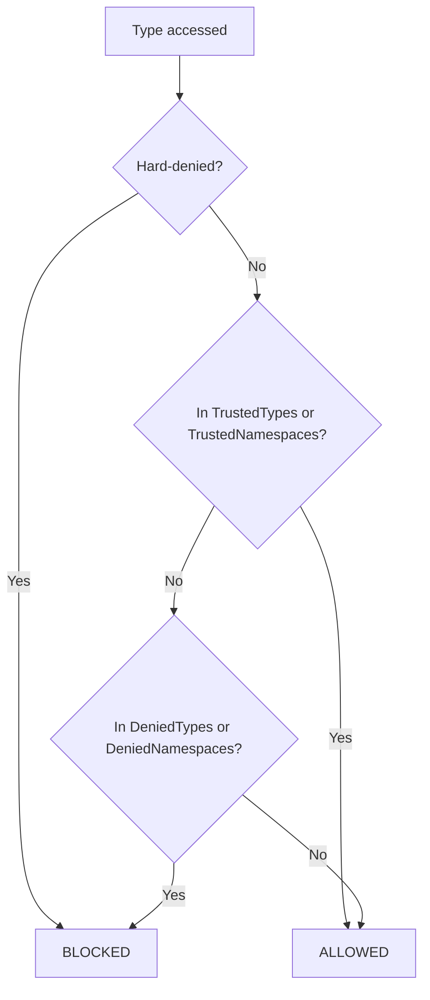

Three layers of control: operation permissions, type/namespace blocking, and execution limits.

**Operation permissions and type blocking** are enforced as a bound tree pipeline pass before execution begins. The entire expression tree is validated against the policy. If any node violates a permission, evaluation never starts.

**Execution limits** (statement count, loop iterations, timeout, collection size) are enforced at runtime.

## Sandbox Presets

| Permission | `Trusted()` | `Safe()` | `Strict()` |
|------------|:-----------:|:--------:|:----------:|
| `AllowMethodCalls` | yes | **no** | **no** |
| `AllowPropertyRead` | yes | yes | yes |
| `AllowStaticPropertyRead` | yes | yes | yes |
| `AllowStaticFieldRead` | yes | yes | yes |
| `AllowAssignment` | yes | yes | **no** |
| `AllowPropertySet` | yes | yes | **no** |
| `AllowIndexSet` | yes | yes | **no** |
| `AllowConstruction` | yes | **no** | **no** |

```csharp
var trusted = new AlderEngine();  // default
var safe = new AlderEngine(o => o.Sandbox = SandboxOptions.Safe());
var strict = new AlderEngine(o => o.Sandbox = SandboxOptions.Strict());
```

<!-- test: Security_Presets -->

### What each permission controls

| Permission | Blocks |
|------------|--------|
| `AllowMethodCalls` | `"hello".ToUpper()`, `Math.Round(3.14)` (non-module, non-extension calls) |
| `AllowPropertyRead` | `obj.Name`, `list.Count` |
| `AllowStaticPropertyRead` | `int.MaxValue`, `DateTime.Now` |
| `AllowStaticFieldRead` | `string.Empty`, `double.NaN` |
| `AllowAssignment` | `x = 5`, `x += 1`, `x++` |
| `AllowPropertySet` | `obj.Name = "x"`, `obj.Count++` |
| `AllowIndexSet` | `arr[0] = 1`, `dict["key"] = val` |
| `AllowConstruction` | `new List<int>()`, `new DateTime(2024, 1, 1)` |

Extension methods (LINQ) and module methods bypass `AllowMethodCalls`. They are host-registered and trusted.

### Custom sandbox

`SandboxOptions` is a `record`. Use `with` to customize:

```csharp
var engine = new AlderEngine(o =>
{
    o.Sandbox = SandboxOptions.Safe() with
    {
        AllowMethodCalls = true,
        AllowConstruction = true
    };
});
```

<!-- test: Security_CustomSandbox -->

## Type Blocking

Every type accessed in the expression is evaluated through a four-layer decision:



### Hard-denied types

Always blocked, regardless of configuration:

- `AlderEngine`
- `AlderOptions`
- `AlderExpression`

Prevents expressions from accessing engine internals.

### Default denied types

| Type | Risk |
|------|------|
| `Activator` | Arbitrary type instantiation |
| `AppDomain` | Process-level access |
| `Console` | I/O side effects |
| `Delegate`, `MulticastDelegate` | Delegate manipulation |
| `Environment` | System information, env vars |
| `GC` | Garbage collector control |
| `WeakReference`, `WeakReference<>` | Object lifetime manipulation |
| `Thread`, `ThreadPool` | Thread creation |
| `Process`, `ProcessStartInfo` | Process execution |
| `Marshal` | Unmanaged memory |

### Default denied namespaces

| Namespace | Category |
|-----------|----------|
| `System.CodeDom`, `System.Linq.Expressions`, `System.Reflection`, `System.Reflection.Emit`, `System.Runtime.CompilerServices`, `System.Runtime.Loader`, `System.Runtime.Serialization`, `Microsoft.CSharp` | Code generation |
| `System.Diagnostics`, `System.IO`, `System.ServiceProcess`, `System.Management`, `Microsoft.Win32` | OS/process access |
| `System.Net`, `System.Net.Http`, `System.Net.Mail`, `System.Net.NetworkInformation`, `System.Net.Sockets` | Network access |
| `System.Threading` | Thread management |
| `System.Runtime.InteropServices`, `System.Security` | Interop/security |
| `System.Data`, `Microsoft.Data` | Database access |
| `System.Configuration`, `System.ComponentModel`, `System.ComponentModel.Composition`, `System.Composition`, `System.DirectoryServices`, `System.Resources` | Configuration |

### Trusting specific types

`TrustedTypes` and `TrustedNamespaces` carve exceptions through deny lists:

```csharp
var engine = new AlderEngine(o =>
{
    o.Sandbox = SandboxOptions.Safe() with
    {
        TrustedTypes = new HashSet<Type>
        {
            typeof(System.IO.MemoryStream),
            typeof(System.IO.FileAttributes)
        }
    };
});
```

<!-- test: Security_TrustedTypes -->

Trusted types are checked before denied types. A type in `TrustedTypes` passes even if its namespace is in `DeniedNamespaces`. Hard-denied types cannot be overridden.

### Namespace matching

Prefix-with-dot algorithm: blocking `"System.Net"` blocks `System.Net` and `System.Net.Http` but not `System.NetCore`. The dot separator prevents false positives.

### Reflection blocking

Even in `Trusted()` mode, reflection access is blocked. `GuardReflectionLeak` runs at every member access return site and blocks values assignable to `Type`, `MemberInfo`, `Assembly`, `Module`, `MethodBody`, `RuntimeTypeHandle`, `RuntimeMethodHandle`, `RuntimeFieldHandle`, pointers, `IntPtr`, `UIntPtr`, and anything in `System.Reflection.Emit`. The check is recursive (`List<MethodInfo>` and `Type[]` are blocked).

For non-sealed reference types (`object`, interfaces), the guard runs at runtime. Value types and `string` are exempt.

```csharp
// Blocked even in Trusted mode:
// typeof(string).GetMethods()  → ALDR0108
```

<!-- test: Security_ReflectionBlocked -->

## Execution Limits

```csharp
var engine = new AlderEngine(o =>
{
    o.Constraints = new ExecutionConstraints
    {
        MaxStatements = 10_000,
        MaxLoopIterations = 1_000,
        MaxTimeout = TimeSpan.FromSeconds(5)
    };
});
```

<!-- test: Security_ExecutionLimits -->

| Constraint | Diagnostic | Exception |
|-----------|------------|-----------|
| `MaxStatements` | `ALDR0200` | `AlderExecutionLimitException` |
| `MaxTimeout` | `ALDR0201` | `AlderExecutionLimitException` |
| `MaxLoopIterations` | `ALDR0203` | `AlderExecutionLimitException` |

`AlderExecutionLimitException` properties:

| Property | Type |
|----------|------|
| `LimitType` | `ExecutionLimitType` (`Statements`, `Timeout`, `LoopIterations`) |
| `LimitValue` | `long` |
| `ActualValue` | `long` |
| `StatementsExecuted` | `long` |
| `ElapsedTime` | `TimeSpan` |

### Collection and Regex Limits

On `SandboxOptions`:

| Property | Default |
|----------|---------|
| `MaxCollectionSize` | 10,000,000 (enforced on `new T[size]`, `.ToList()`, `.ToArray()`) |
| `RegexTimeout` | 1 second (for `=~`, `!~`) |

```csharp
o.Sandbox = SandboxOptions.Safe() with
{
    MaxCollectionSize = 1_000,
    RegexTimeout = TimeSpan.FromMilliseconds(100)
};
```

## Enforcement Architecture

Security is a single pipeline pass (`SecurityValidationPass`), first in every pipeline:

- **Interpretation**: SecurityValidation > ConstantFolding > DeadBranchElimination
- **Compilation**: SecurityValidation > ConstantFolding > DeadBranchElimination > ConversionInsertion

The pass always walks the full tree regardless of configuration. Stack-based traversal prevents overflow on deeply nested expressions. Runtime `IsTypeAllowed` checks provide a second layer for types discovered at evaluation time.
