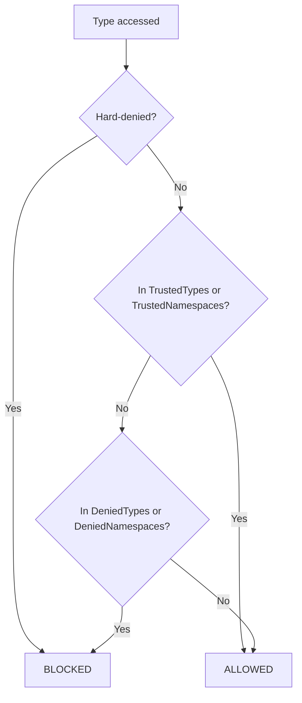

Alder evaluates user-supplied C# code safely in production environments — multi-tenant SaaS, rule engines processing untrusted formulas, configuration-driven business logic, interactive REPLs. The security model provides three layers of control: operation permissions, type and namespace blocking, and execution limits.

**Operation permissions and type blocking** are enforced as a bound tree pipeline pass before execution begins. The entire expression tree is validated against the configured policy — every member access, method call, constructor invocation, and assignment is checked. If any node violates the policy, evaluation never starts.

**Execution limits** (statement count, loop iterations, timeout, collection size) are enforced at runtime during evaluation, since they depend on the dynamic behavior of the expression.

## Sandbox Presets

`SandboxOptions` controls which runtime operations expressions can perform. Three presets cover common scenarios:

| Permission | `Trusted()` | `Safe()` | `Strict()` |
|------------|:-----------:|:--------:|:----------:|
| `AllowMethodCalls` | yes | **no** | **no** |
| `AllowPropertyRead` | yes | yes | yes |
| `AllowStaticPropertyRead` | yes | yes | yes |
| `AllowStaticFieldRead` | yes | yes | yes |
| `AllowAssignment` | yes | yes | **no** |
| `AllowPropertySet` | yes | yes | **no** |
| `AllowIndexSet` | yes | yes | **no** |
| `AllowConstruction` | yes | **no** | **no** |

```csharp
// Trusted — no restrictions, full access
var trusted = new AlderEngine();  // default

// Safe — allows property access (instance and static), assignment; blocks method calls and construction
var safe = new AlderEngine(o => o.Sandbox = SandboxOptions.Safe());

// Strict — property reads (instance and static) and static field reads only, everything else blocked
var strict = new AlderEngine(o => o.Sandbox = SandboxOptions.Strict());
```

<!-- test: Security_Presets -->

### What each permission controls

| Permission | Bound nodes checked | What it blocks |
|------------|-------------------|----------------|
| `AllowMethodCalls` | `BoundResolvedCallExpr` (non-module, non-extension) | `"hello".ToUpper()`, `Math.Round(3.14)` |
| `AllowPropertyRead` | `BoundPropertyAccessExpr`, `BoundFieldAccessExpr`, `BoundDynamicMemberAccessExpr` | `obj.Name`, `list.Count` |
| `AllowStaticPropertyRead` | `BoundPropertyAccessExpr` (static), `BoundFieldAccessExpr` (static) | `int.MaxValue`, `DateTime.Now` |
| `AllowStaticFieldRead` | `BoundFieldAccessExpr` (static) | `string.Empty`, `double.NaN` |
| `AllowAssignment` | `BoundAssignExpr`, `BoundCompoundAssignExpr`, `BoundNullCoalesceAssignExpr`, `BoundIncrementDecrementExpr` | `x = 5`, `x += 1`, `x++` |
| `AllowPropertySet` | `BoundMemberAssignExpr`, `BoundMemberCompoundAssignExpr`, `BoundMemberNullCoalesceAssignExpr`, `BoundMemberIncrementExpr` | `obj.Name = "x"`, `obj.Count++` |
| `AllowIndexSet` | `BoundIndexAssignExpr`, `BoundIndexCompoundAssignExpr`, `BoundIndexNullCoalesceAssignExpr`, `BoundIndexIncrementExpr`, `BoundMultiDimIndexAssignExpr` | `arr[0] = 1`, `dict["key"] = val` |
| `AllowConstruction` | `BoundObjectCreationExpr` | `new List<int>()`, `new DateTime(2024, 1, 1)` |

Extension methods (LINQ's `Where`, `Select`, etc.) bypass the `AllowMethodCalls` check — they're always allowed. Module methods registered via `AlderOptions.Modules` also bypass this check.

### Custom sandbox

`SandboxOptions` is a `record` with `init` properties. Use `with` on a preset to customize:

```csharp
var engine = new AlderEngine(o =>
{
    o.Sandbox = SandboxOptions.Safe() with
    {
        AllowMethodCalls = true,  // re-enable method calls
        AllowConstruction = true   // re-enable new
    };
});
```

<!-- test: Security_CustomSandbox -->

## Type Blocking

Beyond permission flags, the security policy evaluates every type accessed in the expression through a four-layer decision:



### Hard-denied types

These are always blocked regardless of any sandbox configuration:

- `AlderEngine`
- `AlderOptions`
- `AlderExpression`

This prevents expressions from accessing Alder's own internals to reconfigure the engine or escape the sandbox.

### Default denied types

When no custom `DeniedTypes` is specified, these types are blocked:

| Type | Risk |
|------|------|
| `Activator` | Arbitrary type instantiation |
| `AppDomain` | Process-level access |
| `Console` | I/O side effects |
| `Delegate`, `MulticastDelegate` | Delegate manipulation |
| `Environment` | System information, environment variables |
| `GC` | Garbage collector control |
| `WeakReference`, `WeakReference<>` | Object lifetime manipulation |
| `Thread` | Thread creation (if available) |
| `ThreadPool` | Thread pool access (if available) |
| `Process`, `ProcessStartInfo` | Process execution (if available) |
| `Marshal` | Unmanaged memory access (if available) |

### Default denied namespaces

| Namespace | Risk category |
|-----------|--------------|
| `System.CodeDom`, `System.Linq.Expressions`, `System.Reflection`, `System.Reflection.Emit`, `System.Runtime.CompilerServices`, `System.Runtime.Loader`, `System.Runtime.Serialization`, `Microsoft.CSharp` | Code generation and dynamic compilation |
| `System.Diagnostics`, `System.IO`, `System.ServiceProcess`, `System.Management`, `Microsoft.Win32` | OS and process access |
| `System.Net`, `System.Net.Http`, `System.Net.Mail`, `System.Net.NetworkInformation`, `System.Net.Sockets` | Network access |
| `System.Threading` | Thread creation and synchronization |
| `System.Runtime.InteropServices`, `System.Security` | Security and interop |
| `System.Data`, `Microsoft.Data` | Database access |
| `System.Configuration`, `System.ComponentModel`, `System.ComponentModel.Composition`, `System.Composition`, `System.DirectoryServices`, `System.Resources` | Configuration and composition |

### Allowing specific types through the deny lists

Use `TrustedTypes` or `TrustedNamespaces` to carve out exceptions:

```csharp
var engine = new AlderEngine(o =>
{
    o.Sandbox = SandboxOptions.Safe() with
    {
        TrustedTypes = new HashSet<Type>
        {
            typeof(System.IO.MemoryStream),  // allow MemoryStream specifically
            typeof(System.IO.FileAttributes)  // allow FileAttributes enum
        }
    };
});
```

<!-- test: Security_TrustedTypes -->

Trusted types are checked before denied types — a type in `TrustedTypes` passes even if its namespace is in `DeniedNamespaces`. The only exception: hard-denied types (`AlderEngine`, `AlderOptions`, `AlderExpression`) cannot be overridden by `TrustedTypes`.

### Namespace matching

Namespace blocking uses ordinal string comparison with a **prefix-with-dot** algorithm: blocking `"System.Net"` blocks both `System.Net` (exact match) and `System.Net.Http` (prefix `"System.Net."` matches). It does not block `System.NetCore` — the dot separator prevents false positives on similar prefixes. The same algorithm applies to `TrustedNamespaces`.

### Reflection blocking

Even in `Trusted()` mode, Alder blocks reflection access on `Type` objects. The `GuardReflectionLeak` check runs at every member access return site and blocks values whose runtime type is assignable to `Type`, `MemberInfo`, `Assembly`, `Module`, or `MethodBody`, as well as `RuntimeTypeHandle`, `RuntimeMethodHandle`, `RuntimeFieldHandle`, pointers, `IntPtr`, `UIntPtr`, and anything in `System.Reflection.Emit`. The check is recursive — `List<MethodInfo>` and `Type[]` are also blocked.

For non-sealed reference types (e.g., `object`, interfaces), the guard runs at runtime because the actual value could be a forbidden subtype. Value types and `string` are exempt — they cannot carry reflection metadata.

```csharp
// This is blocked even in Trusted mode:
// typeof(string).GetMethods()  → ALDR0108
```

<!-- test: Security_ReflectionBlocked -->

## Execution Limits

`ExecutionConstraints` caps resource usage to prevent denial-of-service from malicious or accidentally infinite expressions:

```csharp
var engine = new AlderEngine(o =>
{
    o.Constraints = new ExecutionConstraints
    {
        MaxStatements = 10_000,              // total statements before ALDR0200
        MaxLoopIterations = 1_000,           // per-loop iteration cap before ALDR0203
        MaxTimeout = TimeSpan.FromSeconds(5) // wall-clock timeout before ALDR0201
    };
});
```

<!-- test: Security_ExecutionLimits -->

| Constraint | Diagnostic | Exception type |
|-----------|------------|----------------|
| `MaxStatements` | `ALDR0200` | `AlderExecutionLimitException` |
| `MaxTimeout` | `ALDR0201` | `AlderExecutionLimitException` |
| `MaxLoopIterations` | `ALDR0203` | `AlderExecutionLimitException` |

`AlderExecutionLimitException` extends `AlderException` with additional properties:

| Property | Type | Description |
|----------|------|-------------|
| `LimitType` | `ExecutionLimitType` | Which limit was exceeded (`Statements`, `Timeout`, `LoopIterations`) |
| `LimitValue` | `long` | The configured limit |
| `ActualValue` | `long` | The value that exceeded the limit |
| `StatementsExecuted` | `long` | Total statements executed before the limit was hit |
| `ElapsedTime` | `TimeSpan` | Wall-clock time when the limit was hit |

### Array and Regex Limits

Two additional limits are configured on `SandboxOptions`:

| Property | Default | Description |
|----------|---------|-------------|
| `MaxCollectionSize` | 10,000,000 | Maximum size for arrays and collections (enforced on `new T[size]`, `.ToList()`, `.ToArray()`, and any method returning `ICollection`) |
| `RegexTimeout` | 1 second | Maximum duration for regex operations (`=~`, `!~`) |

```csharp
o.Sandbox = SandboxOptions.Safe() with
{
    MaxCollectionSize = 1_000,
    RegexTimeout = TimeSpan.FromMilliseconds(100)
};
```

## Security Validation as Pipeline Pass

The security check is not scattered across the engine or compiler — it's a single pipeline pass (`SecurityValidationPass`) that runs before either execution backend. This design means:

1. **Complete coverage**: Every bound node type is checked in one place. Adding a new node kind requires adding its security check to one method.
2. **Fail-fast**: If the expression contains a blocked operation, you get the error immediately — not after partial execution.
3. **Always walks the tree**: The `SecurityValidationPass` always walks the bound tree regardless of sandbox configuration — there is no fast-path skip. This ensures consistent behavior and prevents bypasses.
4. **Stack-based traversal**: The pass uses an explicit stack rather than recursion, preventing stack overflow on deeply nested expressions.

```csharp
// The pass is the first in both pipelines:
// Interpretation: SecurityValidationPass → ConstantFolding → DeadBranchElimination
// Compilation:    SecurityValidationPass → ConstantFolding → DeadBranchElimination → ConversionInsertion
```

Additionally, runtime type checks in `MemberAccess.GetMember` call `IsTypeAllowed` when resolving namespace-qualified type references (e.g., `System.IO.File`), providing a second enforcement layer for types discovered at evaluation time. Module members always bypass sandbox checks (they are host-registered and trusted), though they are still guarded against reflection leaks.
